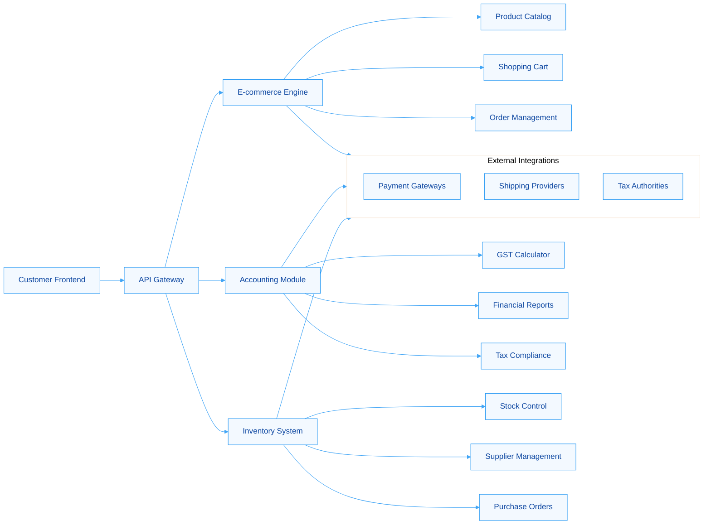
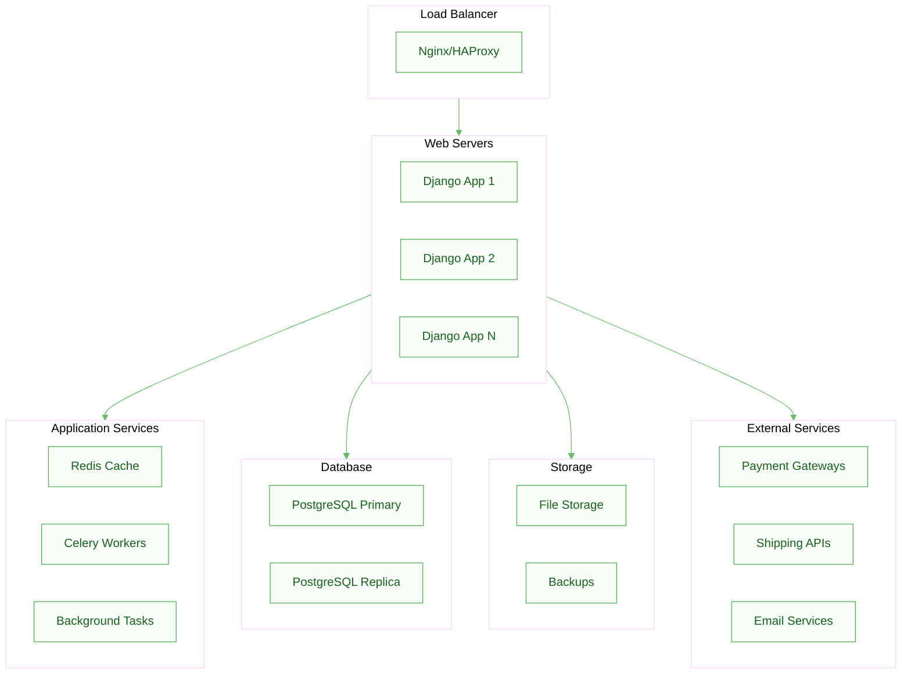

# Project Requirements Document: Singapore SMB E-commerce Platform with Integrated Accounting & Inventory Management

## Executive Summary

This document outlines the comprehensive requirements for a **Singapore-focused e-commerce platform** specifically designed for Small and Medium Businesses (SMBs), with **integrated accounting and inventory management capabilities**. Based on extensive research of Singapore's regulatory landscape and SMB needs, this platform will address critical pain points including GST compliance, inventory tracking, payment processing, and data protection requirements under Singapore's legal framework 【turn0search5】【turn0search8】【turn0search15】.

After thorough analysis of technology options, **Django (Python)** emerges as the recommended framework due to its powerful built-in admin interface, robust ORM for data-heavy applications, and superior scalability for complex inventory and accounting systems.

---

## 1. Project Overview & Business Context

### 1.1 Business Problem
Singapore SMBs face significant challenges managing e-commerce operations while complying with local regulations:
- Complex GST requirements (9% for businesses > SGD 1M annual revenue) 【turn0search8】【turn0search9】
- Fragmented systems for e-commerce, accounting, and inventory
- Need for PDPA compliance 【turn0search15】【turn0search17】
- Payment gateway security requirements 【turn0search11】【turn0search12】
- Inventory cost tracking challenges 【turn0search2】【turn0search3】

### 1.2 Solution Vision
A unified platform that integrates:
- Customer-facing e-commerce storefront
- Automated accounting with GST compliance
- Real-time inventory management
- Analytics and reporting dashboard
- Singapore-specific payment integrations

---

## 2. Detailed Requirements Analysis

### 2.1 E-commerce Core Requirements

#### 2.1.1 Product Catalog Management
- **Product Information**: Detailed product listings with variants, SKUs, pricing
- **Category Management**: Hierarchical categorization with custom attributes
- **Media Management**: Image galleries, video support, optimization
- **Bulk Operations**: Import/export capabilities, bulk pricing updates
- **Multi-language Support**: English, Mandarin (primary Singapore languages)

#### 2.1.2 Shopping Cart & Checkout
- **Cart Management**: Persistent shopping cart, saved items, wishlist
- **Checkout Flow**: Multi-step checkout with guest checkout option
- **Address Management**: Singapore postal code validation 【turn0search14】
- **Order Review**: Detailed order summary with tax breakdown

#### 2.1.3 Customer Management
- **User Accounts**: Registration, login, social login options
- **Profile Management**: Address book, payment methods, order history
- **Customer Segmentation**: B2B, B2C pricing tiers
- **Loyalty Programs**: Points system, promotional codes

### 2.2 Accounting & Financial Requirements

#### 2.2.1 GST Compliance 【turn0search5】【turn0search7】【turn0search8】
- **GST Calculation**: Automatic 9% GST for applicable transactions
- **GST Reporting**: IRAS-compliant GST reports 【turn0search7】
- **Input Tax Credits**: Automated tracking and claiming process
- **Export Taxation**: Zero-rated GST for exports 【turn0search8】
- **Import Taxation**: GST calculation on imported goods 【turn0search8】

#### 2.2.2 Financial Management
- **Invoicing**: Automated invoice generation with GST breakdown
- **Payment Reconciliation**: Matching payments to orders
- **Expense Tracking**: Business expense categorization
- **Financial Reporting**: P&L statements, balance sheets, cash flow
- **Tax Reporting**: Corporate tax preparation support 【turn0search4】

### 2.3 Inventory Management Requirements 【turn0search1】【turn0search2】【turn0search3】

#### 2.3.1 Stock Control
- **Real-time Tracking**: Live inventory levels across channels
- **Multi-location Support**: Warehouse, store inventory tracking
- **Stock Alerts**: Low stock notifications, automated reordering
- **Batch/Lot Tracking**: Expiration date tracking, batch management
- **Inventory Valuation**: FIFO, LIFO, weighted average costing

#### 2.3.2 Inventory Operations
- **Purchase Orders**: Automated PO generation based on stock levels
- **Supplier Management**: Supplier information, pricing, lead times
- **Stock Adjustments**: Manual adjustments, damage tracking
- **Inventory Forecasting**: Demand prediction, seasonal planning

### 2.4 Payment Processing Requirements 【turn0search10】【turn0search11】【turn0search12】【turn0search14】

#### 2.4.1 Payment Gateway Integration
- **Singapore Payment Methods**: 
  - Credit/Debit Cards (Visa, MasterCard, Amex)
  - Local wallets (DBS PayLah, PayNow)
  - International (PayPal, Stripe)
- **Security Compliance**: PCI DSS adherence 【turn0search11】
- **Multi-currency Support**: SGD primary, with currency conversion
- **Recurring Payments**: Subscription management capabilities

#### 2.4.2 Financial Security
- **Fraud Detection**: Address verification, CVV validation
- **Data Encryption**: End-to-end payment data protection
- **Regulatory Compliance**: MAS Payment Services Act compliance 【turn0search12】

### 2.5 Data Protection & Compliance 【turn0search15】【turn0search17】【turn0search18】

#### 2.5.1 PDPA Compliance
- **Consent Management**: Explicit consent for data collection
- **Data Usage Controls**: Purpose limitation, data minimization
- **Access Controls**: Role-based data access
- **Breach Notification**: Automated incident response procedures
- **DPO Registration**: Designated Data Protection Officer functionality 【turn0search18】

#### 2.5.2 Data Security
- **Encryption**: Data at rest and in transit encryption
- **Audit Trails**: Comprehensive logging of data access
- **Data Retention**: Automated data deletion policies
- **Privacy Policies**: Integrated privacy policy management

---

## 3. Technical Requirements & Architecture

### 3.1 Technology Stack Recommendation: Django (Python)

Based on the comparison provided and specific project needs:

| Decision Factor | Django Advantage for This Project |
|----------------|-----------------------------------|
| **Built-in Admin Interface** | **Critical advantage** for inventory and accounting management 【turn0search1】 |
| **ORM Capabilities** | **Single source of truth** for complex financial data models |
| **Performance** | **Efficient handling** of data-heavy inventory and accounting operations |
| **Scalability** | **Proven for complex** data-intensive applications like Instagram |
| **Security** | **Built-in protection** against common web vulnerabilities |
| **Integration** | **Extensive libraries** for accounting, payments, and data analytics |

### 3.2 System Architecture



### 3.3 Database Design

#### 3.3.1 Core Data Models
- **Product Models**: Products, variants, categories, pricing
- **Order Models**: Orders, order items, transactions, invoices
- **Customer Models**: Customers, addresses, preferences
- **Inventory Models**: Stock, locations, movements, adjustments
- **Accounting Models**: Accounts, transactions, tax records
- **User Models**: Users, roles, permissions, audit logs

#### 3.3.2 Data Integrity
- **Referential Integrity**: Foreign key constraints
- **Transaction Consistency**: ACID compliance for financial data
- **Audit Trails**: Complete history of all changes
- **Data Validation**: Input sanitization and validation

### 3.4 Integration Requirements

#### 3.4.1 Payment Gateway APIs 【turn0search11】【turn0search12】【turn0search14】
- **Stripe**: International card processing
- **PayPal**: Global payment acceptance
- **Local Singapore Gateways**: DBS PayLah, PayNow integration
- **Security Standards**: PCI DSS compliance implementation

#### 3.4.2 Shipping & Logistics
- **Singapore Post**: Domestic shipping integration
- **International Carriers**: DHL, FedEx, UPS APIs
- **Real-time Rates**: Dynamic shipping cost calculation
- **Tracking Integration**: Order tracking updates

#### 3.4.3 Accounting Software Integration
- **Xero Singapore**: Local accounting software integration
- **QuickBooks**: Alternative accounting platform
- **Custom Export**: IRAS-compliant data export formats 【turn0search7】

---

## 4. Functional Requirements Specification

### 4.1 E-commerce Functionality

#### 4.1.1 Product Management
```python
# Example Django model structure
class Product(models.Model):
    name = models.CharField(max_length=200)
    sku = models.CharField(max_length=50, unique=True)
    description = models.TextField()
    price = models.DecimalField(max_digits=10, decimal_places=2)
    gst_rate = models.DecimalField(max_digits=5, decimal_places=2, default=0.09)
    stock_quantity = models.PositiveIntegerField(default=0)
    is_active = models.BooleanField(default=True)
    
    def calculate_gst(self):
        return self.price * self.gst_rate
```

#### 4.1.2 Order Processing
- **Order Creation**: Automated order number generation
- **Inventory Deduction**: Real-time stock updates
- **Payment Processing**: Secure payment handling
- **Order Confirmation**: Automated email/SMS notifications
- **Fulfillment Workflow**: Status tracking through delivery

### 4.2 Accounting Functionality

#### 4.2.1 GST Management 【turn0search5】【turn0search8】
- **GST Calculation**: 
  - Standard-rated supplies (9% GST)
  - Zero-rated supplies (exports)
  - Exempt supplies (financial services)
- **GST Reporting**: IRAS-formatted reports 【turn0search7】
- **Input Tax Credit Tracking**: Automated calculation and claims

#### 4.2.2 Financial Reporting
- **Sales Reports**: By product, category, time period
- **Tax Reports**: GST breakdown, corporate tax preparation
- **Profit Analysis**: Margin calculation by product/category
- **Cash Flow**: Inflows/outflows tracking and forecasting

### 4.3 Inventory Management Functionality

#### 4.3.1 Stock Control 【turn0search1】【turn0search2】
- **Multi-location Tracking**: Warehouse, store, consignment
- **Stock Movements**: Complete audit trail of all changes
- **Reorder Points**: Automated alerts based on sales velocity
- **Stock Valuation**: Multiple costing methods (FIFO, weighted average)

#### 4.3.2 Supplier Management
- **Supplier Database**: Contact information, payment terms
- **Purchase Orders**: Automated PO generation
- **Receiving Process**: Goods receipt with quality control
- **Supplier Performance**: Rating and evaluation system

---

## 5. Non-Functional Requirements

### 5.1 Performance Requirements
- **Response Time**: <2 seconds for page loads
- **Throughput**: 1000 concurrent users
- **Database Performance**: Optimized queries with indexing
- **Caching Strategy**: Redis for frequently accessed data

### 5.2 Security Requirements 【turn0search11】【turn0search15】【turn0search17】
- **Data Encryption**: AES-256 for sensitive data
- **Access Control**: Role-based permissions
- **Authentication**: Multi-factor authentication for admin
- **Compliance**: PDPA, PCI DSS, MAS regulations 【turn0search12】【turn0search15】

### 5.3 Scalability Requirements
- **Horizontal Scaling**: Load balancer ready architecture
- **Database Scaling**: Read replicas for reporting
- **Microservices Preparation**: Modular design for future splitting
- **CDN Integration**: Static asset delivery optimization

### 5.4 Usability Requirements
- **Admin Interface**: Intuitive Django admin customization 【turn0search1】
- **Mobile Responsiveness**: Progressive Web App capabilities
- **Accessibility**: WCAG 2.1 compliance
- **Multi-language Support**: English, Mandarin interface options

---

## 6. Regulatory Compliance Requirements

### 6.1 Tax Compliance 【turn0search5】【turn0search7】【turn0search8】

#### 6.1.1 GST Requirements
- **Registration Threshold**: Automated GST registration alerts at SGD 1M revenue
- **GST Filing**: IRAS-compliant GST return preparation 【turn0search7】
- **Record Keeping**: 5-year retention requirement for GST records 【turn0search7】
- **GST Audits**: Complete audit trail support

#### 6.1.2 Corporate Tax
- **Tax Calculation**: Automated corporate tax computation
- **Deduction Tracking**: Business expense categorization
- **Tax Reporting**: IRAS-formatted financial statements 【turn0search4】

### 6.2 Data Protection Compliance 【turn0search15】【turn0search17】【turn0search18】

#### 6.2.1 PDPA Requirements
- **Consent Management**: Granular consent for data processing
- **Purpose Limitation**: Data use only for stated purposes
- **Access Rights**: Customer data access and correction capabilities
- **Data Portability**: Customer data export functionality
- **Breach Management**: 72-hour breach notification workflow

#### 6.2.2 Data Security
- **Encryption Standards**: TLS 1.3 for data in transit
- **Data Minimization**: Collect only necessary data
- **Retention Policies**: Automated data deletion schedules
- **DPO Functions**: Built-in data protection officer tools 【turn0search18】

### 6.3 Payment Regulations 【turn0search10】【turn0search11】【turn0search12】

#### 6.3.1 MAS Compliance
- **Payment Services Act**: Compliance with PSA 2019 【turn0search12】
- **Licensing Requirements**: Proper payment gateway licensing
- **Anti-Money Laundering**: Transaction monitoring and reporting
- **Security Standards**: PCI DSS Level 1 compliance 【turn0search11】

---

## 7. Implementation Plan & Phases

### 7.1 Phase 1: Foundation & Core E-commerce (Weeks 1-8)

#### Sprint 1-2: Project Setup & Core Models
- [ ] Django project architecture setup
- [ ] Database design and models creation
- [ ] User authentication and authorization
- [ ] Basic product catalog functionality
- [ ] Development environment configuration

#### Sprint 3-4: E-commerce Functionality
- [ ] Shopping cart implementation
- [ ] Checkout process development
- [ ] Order management system
- [ ] Basic inventory tracking
- [ ] Payment gateway integration (Stripe)

#### Sprint 5-6: Admin Interface & Basic Reporting
- [ ] Django admin customization 【turn0search1】
- [ ] Basic sales reporting
- [ ] Inventory management interface
- [ ] Customer management tools
- [ ] Security implementation

#### Sprint 7-8: Testing & Deployment
- [ ] Unit and integration testing
- [ ] Performance optimization
- [ ] Security audit
- [ ] Production deployment
- [ ] User acceptance testing

### 7.2 Phase 2: Accounting & GST Compliance (Weeks 9-16)

#### Sprint 9-10: Accounting Foundation
- [ ] Chart of accounts setup
- [ ] Transaction recording system
- [ ] Invoice generation
- [ ] Expense tracking
- [ ] Basic financial reports

#### Sprint 11-12: GST Compliance 【turn0search5】【turn0search8】
- [ ] GST calculation engine
- [ ] GST reporting system
- [ ] Input tax credit tracking
- [ ] IRAS-compliant exports 【turn0search7】
- [ ] Tax filing preparation

#### Sprint 13-14: Advanced Accounting
- [ ] Automated bank reconciliation
- [ ] Financial statement generation
- [ ] Budget tracking
- [ ] Multi-currency support
- [ ] Year-end closing procedures

#### Sprint 15-16: Integration & Testing
- [ ] Accounting software integration
- [ ] Comprehensive testing
- [ ] Compliance verification
- [ ] Documentation
- [ ] Training materials

### 7.3 Phase 3: Advanced Inventory & Analytics (Weeks 17-24)

#### Sprint 17-18: Advanced Inventory Management 【turn0search1】【turn0search2】
- [ ] Multi-location inventory
- [ ] Batch and lot tracking
- [ ] Automated reordering
- [ ] Supplier management
- [ ] Purchase order system

#### Sprint 19-20: Analytics & Reporting
- [ ] Sales analytics dashboard
- [ ] Inventory optimization
- [ ] Customer behavior analysis
- [ ] Financial performance metrics
- [ ] Custom report builder

#### Sprint 21-22: Integrations & Automation
- [ ] Shipping provider integrations
- [ ] Email marketing integration
- [ ] API development for third parties
- [ ] Workflow automation
- [ ] Mobile app development

#### Sprint 23-24: Final Testing & Launch
- [ ] End-to-end testing
- [ ] Load testing
- [ ] Security penetration testing
- [ ] Compliance audit
- [ ] Production launch

---

## 8. Success Criteria & KPIs

### 8.1 Technical Success Metrics
- **Performance**: <2 second page load time
- **Availability**: 99.9% uptime
- **Security**: Zero critical vulnerabilities
- **Scalability**: Handle 10x traffic growth

### 8.2 Business Success Metrics
- **User Adoption**: 80% of SMB users actively using all modules
- **Compliance**: 100% GST and PDPA compliance 【turn0search8】【turn0search15】
- **Efficiency**: 50% reduction in manual accounting tasks
- **Accuracy**: 99.9% inventory accuracy

### 8.3 User Satisfaction Metrics
- **Net Promoter Score**: >8
- **User Retention**: >90% annual retention
- **Support Tickets**: <5% of users requiring support monthly
- **Feature Adoption**: >70% of features used by majority

---

## 9. Risk Assessment & Mitigation

### 9.1 Technical Risks

| Risk | Probability | Impact | Mitigation Strategy |
|------|-------------|--------|-------------------|
| Database performance issues | Medium | High | Implement proper indexing, query optimization, caching |
| Payment gateway integration challenges | Low | High | Use established SDKs, thorough testing, fallback options |
| Security vulnerabilities | Medium | Critical | Regular security audits, penetration testing, updates |
| Scalability limitations | Low | High | Microservices architecture, load testing, cloud infrastructure |

### 9.2 Business Risks

| Risk | Probability | Impact | Mitigation Strategy |
|------|-------------|--------|-------------------|
| Regulatory changes (GST/PDPA) | High | Medium | Flexible architecture, compliance monitoring, legal consultation |
| User adoption challenges | Medium | High | User-centered design, training, support, iterative improvements |
| Competitive pressure | High | Medium | Continuous innovation, unique features, excellent UX |
| Payment gateway fee changes | Medium | Medium | Multiple gateway options, negotiation, cost transparency |

### 9.3 Project Risks

| Risk | Probability | Impact | Mitigation Strategy |
|------|-------------|--------|-------------------|
| Scope creep | High | Medium | Clear requirements, change control process, regular stakeholder alignment |
| Timeline delays | Medium | High | Agile methodology, regular milestones, buffer time |
| Budget overruns | Medium | High | Detailed cost tracking, regular reviews, contingency planning |
| Team availability | Low | High | Cross-training, documentation, knowledge sharing |

---

## 10. Quality Assurance Plan

### 10.1 Testing Strategy

#### 10.1.1 Unit Testing
- **Coverage Target**: 90% code coverage
- **Tools**: pytest, Django test framework
- **Automation**: CI/CD pipeline integration

#### 10.1.2 Integration Testing
- **API Testing**: Comprehensive endpoint testing
- **Database Testing**: Data integrity verification
- **Third-party Integration**: Payment gateway, shipping providers

#### 10.1.3 End-to-End Testing
- **User Journeys**: Complete transaction flows
- **Cross-browser Testing**: Multiple browser compatibility
- **Mobile Testing**: Responsive design verification

#### 10.1.4 Performance Testing
- **Load Testing**: Simulated user traffic
- **Stress Testing**: Breaking point identification
- **Volume Testing**: Large dataset handling

#### 10.1.5 Security Testing
- **Vulnerability Scanning**: OWASP Top 10 coverage
- **Penetration Testing**: External security audit
- **Compliance Testing**: PDPA, PCI DSS verification 【turn0search11】【turn0search15】

### 10.2 Quality Metrics
- **Defect Density**: <1 critical defect per 1000 lines of code
- **Test Coverage**: >90% code coverage
- **Performance**: <2 second response time
- **Security**: Zero critical vulnerabilities
- **Compliance**: 100% regulatory adherence

---

## 11. Deployment & Infrastructure Plan

### 11.1 Infrastructure Architecture



### 11.2 Deployment Strategy

#### 11.2.1 Environment Setup
- **Development**: Local Docker containers
- **Staging**: Production-like environment for testing
- **Production**: High-availability cloud infrastructure

#### 11.2.2 CI/CD Pipeline
- **Source Control**: Git with feature branch workflow
- **Automated Testing**: Test execution on every commit
- **Deployment**: Automated deployment to staging
- **Production Deployment**: Manual approval with blue-green deployment

#### 11.2.3 Monitoring & Logging
- **Application Monitoring**: APM tools for performance tracking
- **Error Tracking**: Automated error notification and logging
- **Infrastructure Monitoring**: Server health and resource utilization
- **Business Metrics**: Custom dashboards for KPI tracking

---

## 12. Budget & Resource Planning

### 12.1 Development Team Structure

| Role | FTE Allocation | Duration | Key Responsibilities |
|------|----------------|----------|---------------------|
| Project Manager | 1.0 | 24 weeks | Project coordination, stakeholder management |
| Lead Developer | 1.0 | 24 weeks | Technical architecture, code review |
| Backend Developer | 2.0 | 24 weeks | Django development, API creation |
| Frontend Developer | 1.5 | 20 weeks | User interface, user experience |
| QA Engineer | 1.0 | 20 weeks | Testing strategy, quality assurance |
| DevOps Engineer | 0.5 | 16 weeks | Infrastructure, deployment, monitoring |
| UI/UX Designer | 0.5 | 12 weeks | Design system, user experience |

### 12.2 Estimated Budget

| Category | Cost Range (SGD) | Notes |
|----------|------------------|-------|
| Personnel | $350,000 - $450,000 | Based on Singapore tech salaries |
| Infrastructure | $30,000 - $50,000 | Cloud hosting, databases, CDN |
| Software Licenses | $20,000 - $30,000 | Development tools, monitoring |
| Compliance & Legal | $15,000 - $25,000 | Legal review, compliance consulting |
| Contingency | $40,000 - $60,000 | 10-15% of total budget |
| **Total Estimated** | **$455,000 - $615,000** | **24-week development cycle** |

### 12.3 Ongoing Operational Costs

| Category | Monthly Cost (SGD) | Annual Cost (SGD) |
|----------|-------------------|-------------------|
| Hosting & Infrastructure | $3,000 - $5,000 | $36,000 - $60,000 |
| Software Subscriptions | $1,000 - $2,000 | $12,000 - $24,000 |
| Payment Gateway Fees | Variable | Variable |
| Maintenance & Support | $5,000 - $8,000 | $60,000 - $96,000 |
| Compliance Updates | $1,000 - $2,000 | $12,000 - $24,000 |
| **Total Monthly** | **$10,000 - $17,000** | **$120,000 - $204,000** |

---

## 13. Post-Launch Support & Maintenance

### 13.1 Support Structure

#### 13.1.1 Tier 1 Support
- **User Assistance**: Basic user guidance and FAQ
- **Issue Triage**: Initial problem identification and escalation
- **Response Time**: <4 hours during business hours

#### 13.1.2 Tier 2 Support
- **Technical Issues**: Application bug fixes and troubleshooting
- **System Administration**: Database maintenance, performance tuning
- **Response Time**: <2 hours for critical issues

#### 13.1.3 Tier 3 Support
- **Development Issues**: Code-level fixes and enhancements
- **Architecture Improvements**: System optimization and scaling
- **Response Time**: <1 hour for critical production issues

### 13.2 Maintenance Activities

#### 13.2.1 Regular Maintenance
- **Security Updates**: Monthly patch application
- **Performance Optimization**: Quarterly performance tuning
- **Backup Verification**: Weekly backup testing
- **Compliance Updates**: As regulations change 【turn0search8】【turn0search15】

#### 13.2.2 Enhancement Planning
- **Feature Roadmap**: Quarterly feature planning
- **User Feedback Integration**: Monthly feedback review
- **Technology Updates**: Annual technology stack review
- **Competitive Analysis**: Semi-annual competitive review

---

## 14. Conclusion & Next Steps

### 14.1 Project Summary
This comprehensive requirements document outlines the development of a **Singapore-focused e-commerce platform** with integrated accounting and inventory management capabilities. The solution addresses critical SMB pain points including GST compliance, inventory tracking, and regulatory requirements while leveraging Django's powerful admin interface and robust ORM for optimal functionality.

### 14.2 Key Success Factors
1. **Regulatory Compliance**: Full GST and PDPA compliance 【turn0search8】【turn0search15】
2. **User Experience**: Intuitive interface for non-technical users
3. **Integration Capability**: Seamless connection to payment gateways and accounting systems
4. **Scalability**: Architecture designed for growth
5. **Security**: Enterprise-grade security and data protection

### 14.3 Immediate Next Steps

1. **Stakeholder Review**: Present this document to all stakeholders for approval
2. **Team Assembly**: Recruit and onboard the development team
3. **Environment Setup**: Establish development, staging, and production environments
4. **Detailed Design**: Create detailed technical specifications for each module
5. **Vendor Selection**: Finalize payment gateway and hosting providers
6. **Legal Review**: Conduct comprehensive compliance review with legal experts

### 14.4 Long-term Vision
The platform will evolve to include:
- **AI-powered Insights**: Predictive analytics for inventory and sales
- **Advanced Automation**: Workflow automation for routine tasks
- **Mobile Applications**: Native iOS and Android apps
- **Marketplace Integration**: Expansion to online marketplaces
- **International Expansion**: Support for cross-border e-commerce

---

## Appendices

### Appendix A: Regulatory References
- [IRAS GST Guide for E-commerce] 【turn0search5】
- [PDPA Compliance Guidelines] 【turn0search15】
- [MAS Payment Services Act] 【turn0search12】
- [PCI DSS Security Standards] 【turn0search11】

### Appendix B: Technical Specifications
- Detailed API documentation
- Database schema diagrams
- Security implementation details
- Performance benchmarks

### Appendix C: User Research Summary
- SMB pain points analysis
- Feature prioritization survey results
- Competitive analysis matrix
- User persona definitions

---

**Document Version**: 1.0  
**Last Updated**: 2025-12-17  
**Next Review Date**: 2025-12-24  
**Approved By**: _______________________  
**Date**: _______________________

This comprehensive requirements document serves as the foundation for developing a successful e-commerce platform tailored to Singapore SMBs, with particular attention to regulatory compliance, integrated functionality, and long-term scalability.
