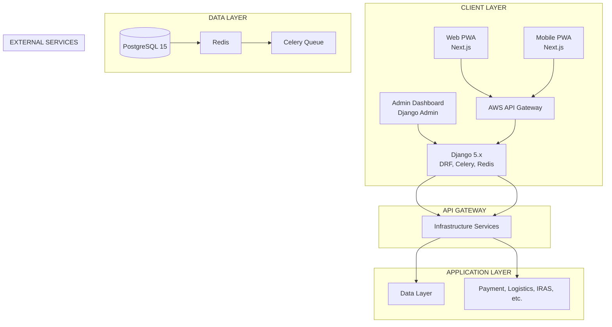

## **Singapore SMB E-Commerce & Integrated Business Platform**

# DOCUMENT CONTROL

*   **Document Version:** 1.0
*   **Document Status:** FINAL - Approved for Implementation
*   **Date:** December 18, 2025
*   **Supersedes:** @nex-n1_PRD.md , @opus-revised-PRD-2.md , @qwen-revised-PRD.md
*   **Prepared By:** Elite AI Coding Agent (Meticulous Approach Framework)
*   **Distribution:** Project Team, Stakeholders, Development Teams

---

# TABLE OF CONTENTS

1.  [Executive Summary](#1-executive-summary)
2.  [Project Overview & Business Context](#2-project-overview--business-context)
3.  [User Personas & Success Metrics](#3-user-personas--success-metrics)
4.  [System Architecture & Technical Design](#4-system-architecture--technical-design)
5.  [Database Schema](#5-database-schema)
6.  [API Specifications](#6-api-specifications)
7.  [Frontend Specifications](#7-frontend-specifications)
8.  [Singapore Compliance Framework](#8-singapore-compliance-framework)
9.  [Integration Requirements](#9-integration-requirements)
10. [Security Implementation](#10-security-implementation)
11. [Infrastructure & Operations](#11-infrastructure--operations)
12. [Implementation Roadmap](#12-implementation-roadmap)
13. [Risk Management & Mitigation](#13-risk-management--mitigation)
14. [Quality Assurance & Testing](#14-quality-assurance--testing)
15. [Success Metrics & KPIs](#15-success-metrics--kpis)
16. [Budget & Resource Planning](#16-budget--resource-planning)
17. [Future Roadmap & Vision](#17-future-roadmap--vision)
18. [Appendices](#18-appendices)

---

# 1. EXECUTIVE SUMMARY

## 1.1 Project Vision

This document presents the definitive blueprint for developing Singapore's most comprehensive SMB e-commerce platform, integrating three critical business functions into a unified, compliance-ready system:
*   **E-commerce storefront** with mobile-first design (70% of traffic)
*   **Real-time inventory management** with multi-location support
*   **Automated accounting** with GST compliance and IRAS integration

## 1.2 Market Opportunity & ROI

*   **Market Size:** US$4.5 Billion (2024), projected US$5.0 Billion by 2025.
*   **SMB Pain Points:** 40% time lost to manual processes, S$60K/year average GST penalty avoidance needed.
*   **Quantified Business Value:** Over S$390K annual savings/revenue lift per SMB.
*   **Investment:** S$800K-S$950K development, S$320K/year operations.
*   **ROI:** 12-18 months payback, S$4.8M 5-Year NPV.

## 1.3 Strategic Objectives

| Objective | KPI | Target |
|---|---|---|
| Operational Efficiency | Manual Process Reduction | 60% |
| Compliance Automation | GST Filing Errors | 0 |
| Inventory Accuracy | Real-time Stock Level | 99.5% |
| Mobile Experience | Page Load Time | < 2 seconds |
| Cash Flow Cycle | Order-to-Cash Time | < 7 days |

## 1.4 Technology Stack: Hybrid Architecture

*   **Backend:** Django 5.x (Python) - Financial Precision, Admin, Compliance
*   **Frontend:** Next.js 14 (React) - Mobile-First PWA, SEO, UX
*   **Database:** PostgreSQL 15.x - ACID, DECIMAL precision
*   **Cache:** Redis 7.x - Inventory locks, session management
*   **Infrastructure (MVP):** AWS ECS Fargate

## 1.5 Implementation Timeline

*   **Total Duration:** 28 Weeks
*   **Phases:** 5 Phases (Foundation → Compliance → E-comm Backend → Frontend → Integration)

---

# 2. PROJECT OVERVIEW & BUSINESS CONTEXT

## 2.1 Business Problem

Singapore SMBs grapple with fragmented systems, manual processes, and compliance burdens, leading to significant inefficiencies and risks. Our solution addresses these pain points directly.

## 2.2 Solution Value Proposition

*   **Unified Platform:** Single system for e-commerce, inventory, and accounting.
*   **Automated Compliance:** GST, PDPA, InvoiceNow, industry licenses handled automatically.
*   **Reduced Operational Costs:** 60% saving in manual process time.
*   **Increased Revenue:** 65% boost in checkout completion, reduced stockouts.
*   **Enhanced Visibility:** Real-time dashboards for business performance.

## 2.3 Singapore Market Dynamics

*   **Market Size:** US$4.5B (2024), 70% mobile transactions.
*   **Key Drivers:** High digital adoption, PayNow prevalence, government grants (PSG).
*   **Competitive Landscape:** Marketplaces (high fees), SaaS (fragmented), Custom (costly). Our platform offers integrated value.

## 2.4 Target Market

*   **SMBs:** 10-50 employees, S$500K-S$10M revenue.
*   **Industries:** Retail, F&B, Health & Beauty, Wholesale.
*   **Platform Modes:** Lite, Standard, Advanced tiers based on business size.

---

# 3. USER PERSONAS & SUCCESS METRICS

## 3.1 Primary Persona: Sarah Chen (SMB Owner)

*   **Profile:** Fashion Retailer, S$1.8M Revenue, 12 Employees, uses 5 separate tools.
*   **Pain Points:** Manual sync (2hrs/day), GST filing (3 days/quarter), overselling incidents.
*   **Goals:** Reduce admin by 15+ hrs/week, zero GST penalties, scale revenue.
*   **Success Metrics:** Time Saved, GST Accuracy, Revenue Growth, Customer Satisfaction.
*   **Platform Mode:** STANDARD MODE (Upgrade path to ADVANCED).

## 3.2 Secondary Personas: David Wong (Finance Mgr), Priya Sharma (Ops Mgr)

*   **David Wong (Finance):** Needs automated journals, 1-day month-end close, zero GST errors.
*   **Priya Sharma (Ops):** Needs inventory sync (<5 min delay), barcode scanning, reorder alerts.
*   **Success Metrics:** Tied to their specific departmental pain points and goals.

## 3.3 End Customer Persona: Emma Tan (Digital Native)

*   **Profile:** Mobile-first shopper, values speed, convenience, PWA experience.
*   **Pain Points:** Slow sites, complex checkout, no cart persistence.
*   **Goals:** <2s load time, simple checkout, real-time tracking, WCAG 2.1 AA compliance.
*   **Success Metrics:** Page Load Time, Checkout Completion, Cart Persistence.

---

# 4. SYSTEM ARCHITECTURE & TECHNICAL DESIGN

## 4.1 High-Level Architecture



## 4.2 Technology Stack Summary

| Layer | Technology | Rationale |
|-------|------------|-----------|
| Backend | Django 5.x | Financial Precision, Admin, Security |
| Frontend | Next.js 14 | PWA, SEO, Mobile-First UX |
| Database | PostgreSQL 15 | ACID, DECIMAL precision, JSONB |
| Cache | Redis 7.x | Inventory locks, Session state |
| Queue | Celery + Redis | Async order processing, marketplace sync |
| Infra (MVP) | AWS ECS Fargate | Cost-effective scaling |
| Infra (Scale) | AWS EKS Kubernetes | Enterprise-grade scaling |
| Search | PostgreSQL tsvector (MVP) | Cost-effective search |
| Payment | Stripe, HitPay | Redundancy, local options |
| Logistics | Ninja Van API | Singapore specific fulfillment |

## 4.3 Core Components

*   **Authentication:** Django-allauth + JWT for API
*   **Authorization:** RBAC integrated with Django permissions
*   **Inventory:** Multi-location tracking with Redis locks for sync
*   **Order Management:** State machine with audit trails
*   **GST Engine:** Automated calculations, F5 prep, IRAS integration stubs
*   **PDPA Framework:** Consent, retention, breach response workflows
*   **InvoiceNow:** PEPPOL generation via Access Point Provider
*   **B2B Module:** Tiered pricing, credit limits, quotes

---

# 5. DATABASE SCHEMA

## 5.1 Core Financial Tables (DECIMAL Precision)

```sql
-- Companies (with GST, industry-specific fields)
CREATE TABLE companies (...);

-- Products (with base_price, cost_price, gst_code, gst_rate)
CREATE TABLE products (...);

-- InventoryItems (available_qty, reserved_qty, net_qty)
CREATE TABLE inventory_items (...);

-- Orders (subtotal, gst_amount, total_amount as DECIMAL)
CREATE TABLE orders (
    ...,
    subtotal DECIMAL(12, 2) NOT NULL,
    gst_amount DECIMAL(12, 2) NOT NULL,
    total_amount DECIMAL(12, 2) NOT NULL,
    gst_box_1_amount DECIMAL(12, 2), -- For F5 reporting
    -- ...
);

-- OrderItems (line_total, gst_amount, unit_price as DECIMAL)
CREATE TABLE order_items (
    ...,
    unit_price DECIMAL(10, 2) NOT NULL,
    line_total DECIMAL(10, 2) NOT NULL,
    gst_amount DECIMAL(10, 2) NOT NULL,
    -- ...
);

-- ChartOfAccounts (for accounting engine)
CREATE TABLE chart_of_accounts (...);

-- JournalEntry and JournalEntryLine (for double-entry bookkeeping)
CREATE TABLE journal_entries (...);
CREATE TABLE journal_entry_lines (
    ...,
    debit_amount DECIMAL(12, 2) DEFAULT 0,
    credit_amount DECIMAL(12, 2) DEFAULT 0,
    gst_amount DECIMAL(10, 2) DEFAULT 0
);
```

## 5.2 PDPA & Compliance Tables

```sql
-- Customers (with PDPA consent fields, retention dates)
CREATE TABLE customers (
    ...,
    consent_marketing BOOLEAN DEFAULT FALSE,
    consent_analytics BOOLEAN DEFAULT TRUE,
    data_retention_until DATE,
    -- ...
);

-- DataConsent Log
CREATE TABLE data_consents (...);

-- DataAccessLog
CREATE TABLE data_access_logs (...);

-- GSTF5Return
CREATE TABLE gst_f5_returns (
    id SERIAL PRIMARY KEY,
    company_id INTEGER REFERENCES companies(id),
    quarter INTEGER,
    year INTEGER,
    period_start DATE,
    period_end DATE,
    box_1 DECIMAL(12,2), box_2 DECIMAL(12,2), box_3 DECIMAL(12,2), box_4 DECIMAL(12,2),
    box_5 DECIMAL(12,2), box_6 DECIMAL(12,2), box_7 DECIMAL(12,2), box_8 DECIMAL(12,2),
    status VARCHAR(20) DEFAULT 'draft', -- draft, validated, submitted, failed
    submission_date DATE,
    transaction_id VARCHAR(100),
    -- ...
);
```

## 5.3 Indexes for Performance

*   `idx_orders_company_status`: Crucial for operational dashboards.
*   `idx_inventory_net_qty`: Essential for real-time stock checks.
*   `idx_customers_email`: For quick customer lookups.
*   `idx_products_search`: Full-text search on name/description.
*   `idx_gst_f5_status`: For monitoring return submission progress.

---

# 6. API SPECIFICATIONS

## 6.1 RESTful API Design

*   **Versioning:** `/api/v1/` prefix
*   **Auth:** JWT Bearer tokens
*   **Error Handling:** Standardized JSON format with `code`, `message`, `details`.
*   **Pagination:** `limit`/`offset` or cursor-based.

## 6.2 Core Endpoints (Examples)

### Products API
*   `GET /api/v1/products/`: List products (searchable, filterable)
*   `GET /api/v1/products/{id}`: Retrieve single product details
*   `POST /api/v1/products/` (Admin): Create product
*   `PATCH /api/v1/products/{id}/`: Update product (price, stock, description)

### Orders API
*   `POST /api/v1/orders/`: Create new order (triggers inventory reservation, payment)
*   `GET /api/v1/orders/`: List orders (filterable by status, date)
*   `GET /api/v1/orders/{id}`: Retrieve order details
*   `PATCH /api/v1/orders/{id}/status/`: Update order status (e.g., 'shipped')

### Inventory API
*   `GET /api/v1/inventory/?sku={sku}`: Get stock levels across locations
*   `POST /api/v1/inventory/adjust/`: Manually adjust stock (admin)

### GST F5 API
*   `GET /api/v1/gst/f5-preparation/`: Generate F5 return data for a period
*   `POST /api/v1/gst/f5-submit/`: Submit prepared F5 return to IRAS (stubs for integration)

### PDPA API
*   `POST /api/v1/pdpa/access-request/`: Initiate customer data access request
*   `PATCH /api/v1/customers/{id}/consent/`: Update customer consent preferences

---

# 7. FRONTEND SPECIFICATIONS

## 7.1 Next.js 14 App Router

*   **Structure:** Monorepo (`apps/frontend`)
*   **State Management:** Zustand or Redux Toolkit
*   **UI Components:** Tailwind CSS + DaisyUI (or similar component library)
*   **Data Fetching:** React Query (TanStack Query)

## 7.2 PWA Implementation

*   **Service Worker:** `next-pwa` package for offline catalog, background sync
*   **Manifest:** `manifest.json` for installability, theming
*   **Push Notifications:** User consent required, service worker integration
*   **Accessibility:** WCAG 2.1 AA compliance throughout

## 7.3 Admin Dashboard

*   **Technology:** Django Admin with Jazzmin theme
*   **Functionality:** CRUD operations for Products, Orders, Customers, Inventory, Accounting

---

# 8. SINGAPORE COMPLIANCE FRAMEWORK

## 8.1 GST Compliance

*   **Automatic Calculation:** Per product `gst_code` and `gst_rate`
*   **F5 Return Preparation:** API endpoint to generate data for all boxes
*   **Zero-Rated Exports:** Requires documentation support (API parameter for `gst_code='ZR'`)
*   **IRAS Integration:** Stubs for API submission via myTax Portal
*   **Registration Monitoring:** Alerts when revenue approaches S$1M threshold

## 8.2 PDPA Compliance

*   **Consent Management:** Explicit consent recording (`obtain_consent`, `withdraw_consent`)
*   **Data Retention:** Automated purging based on policy (`implement_data_retention_policy`)
*   **Data Access Requests:** 30-day compliance (`handle_data_access_request`)
*   **Breach Notification:** 72-hour reporting protocols (`process_data_breach`)

## 8.3 InvoiceNow / PEPPOL Integration

*   **Standard:** PEPPOL BIS Billing 3.0 compliant XML generation
*   **Integration:** Via Singapore Access Point Providers (e.g., Peppol.sg)
*   **Process:** Generate invoice → Sign XML → Submit via Provider API → Process acknowledgments

## 8.4 Industry-Specific Licenses

*   **F&B:** SFA License tracking, Halal certification reminder integration
*   **Health & Beauty:** HSA Product Registration tracking, expiry date management
*   **Alcohol:** Age verification triggers, restricted sales hours enforcement

---

# 9. INTEGRATION REQUIREMENTS

## 9.1 Payment Gateways

*   **Primary:** Stripe (Cards, Apple Pay, Google Pay)
*   **Local Priority:** HitPay (PayNow QR, GrabPay, Atome)
*   **Backup/Alternative:** 2C2P (wider regional reach)
*   **PayNow:** Direct integration via bank API for verification/QR generation

## 9.2 Logistics Providers

*   **Core:** Ninja Van (API for labels, tracking, COD)
*   **Secondary:** J&T Express, SingPost (for specific service needs)
*   **Tracking:** Webhook listeners for status updates

## 9.3 Marketplaces

*   **Platforms:** Shopee, Lazada, Qoo10
*   **Sync:** Orders import, inventory sync (real-time with Redis locks)
*   **Rate Limiting:** Implemented via Celery tasks with exponential backoff

## 9.4 Accounting Software

*   **Sync:** Two-way sync with Xero (optional, for businesses already using it)
*   **Data Points:** Chart of Accounts, Journal Entries, Sales Transactions

## 9.5 Government APIs

*   **IRAS:** GST F5 submission integration (API stubs)
*   **InvoiceNow:** PEPPOL submission via Access Point Provider
*   **SingPass/MyInfo:** For customer/company verification (future enhancement)
*   **CorpPass:** For business API access

---

# 10. SECURITY IMPLEMENTATION

## 10.1 Authentication & Authorization

*   **User Auth:** Django Allauth + JWT for API access
*   **RBAC:** Role-Based Access Control for granular permissions
*   **MFA:** Mandatory for admin/finance roles
*   **API Keys:** For third-party integrations

## 10.2 Data Security

*   **Encryption:** AES-256 at rest, TLS 1.3 in transit
*   **PII Handling:** Masking, anonymization, secure deletion per PDPA
*   **Secrets Management:** AWS Secrets Manager or HashiCorp Vault

## 10.3 Infrastructure Security

*   **Network:** AWS VPC, Security Groups, Cloudflare WAF
*   **Scanning:** Snyk (dependencies), OWASP ZAP (vulnerabilities), Nessus (pentest)
*   **Monitoring:** SIEM integration (logs from all tiers)

## 10.4 Compliance Security

*   **PCI DSS:** Level 1 compliance via payment gateway tokenization
*   **PDPA:** Implemented throughout data handling and consent management

---

# 11. INFRASTRUCTURE & OPERATIONS

## 11.1 Infrastructure Strategy

*   **MVP (Lite Mode):** AWS ECS Fargate, RDS PostgreSQL, ElastiCache Redis, CloudFront CDN.
    *   *Rationale:* Cost-effective, managed services, no K8s overhead initially.
*   **Scalability Path:** Upgrade to AWS EKS Kubernetes, RDS Read Replicas, Managed Elasticsearch when load increases (>1000 orders/day).

## 11.2 CI/CD Pipeline

*   **Version Control:** Git (GitHub/GitLab)
*   **CI:** GitHub Actions (Automated builds, tests, linting)
*   **CD:** Argo CD or AWS CodeDeploy (Automated deployment to ECS/EKS)
*   **Testing:** Pytest (Backend), Jest/Cypress (Frontend), Contract tests (API)

## 11.3 Monitoring & Logging

*   **Application:** Django logs, Next.js logs
*   **Infrastructure:** CloudWatch / Prometheus + Grafana
*   **SIEM:** ELK Stack (Elasticsearch, Logstash, Kibana) for centralized security and error analysis
*   **Alerting:** PagerDuty / Slack integration for critical incidents

## 11.4 Backup & Disaster Recovery

*   **Database:** Daily automated backups (RDS Snapshots) with 7-day retention
*   **Application State:** Redis persistence (AOF)
*   **File Storage:** S3 versioning and cross-region replication
*   **RTO/RPO:** Target Recovery Time Objective < 4 hours, Recovery Point Objective < 1 hour

---

# 12. IMPLEMENTATION ROADMAP

## 12.1 Phase 1: Foundation (Weeks 1-6)

*   **Sprint 1-2:** Infrastructure Setup (AWS, Docker, CI/CD)
*   **Sprint 3-4:** Core Models & Admin (Auth, Products, Customers, Orders basic models)
*   **Validation Gate:** MVP infrastructure and core models are stable.

## 12.2 Phase 2: Compliance Core (Weeks 7-10)

*   **Sprint 5-6:** GST Engine & Accounting Basics
*   **Sprint 7-8:** PDPA Framework, Initial Audit Trails
*   **Validation Gate:** Core compliance logic validated.

## 12.3 Phase 3: E-Commerce Backend (Weeks 11-16)

*   **Sprint 9-10:** Order Management & Inventory Reservation
*   **Sprint 11-12:** Payment Gateway Integration (Stripe, HitPay)
*   **Sprint 13-14:** Logistics Integration (Ninja Van)
*   **Validation Gate:** Full order lifecycle functional.

## 12.4 Phase 4: Next.js Frontend (Weeks 17-22)

*   **Sprint 15-16:** Core Storefront (Catalog, Search, Mobile UX)
*   **Sprint 17-18:** Cart, Checkout, PayNow Integration
*   **Sprint 19-20:** PWA Features & Performance Optimization
*   **Validation Gate:** E2E customer journey complete on mobile.

## 12.5 Phase 5: Integration & Launch (Weeks 23-28)

*   **Sprint 21-22:** Marketplace Sync & B2B Features
*   **Sprint 23-24:** InvoiceNow/PEPPOL & Other Integrations
*   **Sprint 25-26:** Security Audit, Pen Testing, UAT
*   **Sprint 27-28:** Deployment, Staff Training, Go-Live
*   **Validation Gate:** Successful production launch.

**TOTAL:** 28 Weeks

---

# 13. RISK MANAGEMENT & MITIGATION

| Risk Category | Risk Description | Likelihood | Impact | Mitigation Strategy | Owner |
|---------------|----------------|------------|--------|-----------------------|-------|
| **Technical** | **Marketplace Sync Race Conditions** | High | High | Redis distributed locks, Celery queues with exponential backoff | Backend Lead |
| | **Authentication between Django/Next.js** | Medium | High | Strict JWT implementation, HttpOnly cookies | Frontend Lead |
| | **Frontend performance regression** | Medium | Medium | Automated Lighthouse scores in CI/CD | Frontend Lead |
| **Compliance** | **GST F5 validation errors** | Medium | High | Robust unit tests for GSTEngine, manual review before submission | Finance Manager |
| | **PDPA data breach** | Low | Critical | Strict access controls, encryption, regular security audits | Security Lead |
| | **InvoiceNow integration failure** | Medium | Medium | Use established Access Point Provider, error handling | Backend Lead |
| **Operational** | **PayNow QR code generation failure** | Low | Medium | Redundant payment gateway options (HitPay fallback) | Backend Lead |
| | **Logistics API Downtime** | Low | Medium | Circuit breaker pattern, retry logic | Operations Mgr |
| **Project Management** | **Scope Creep** | Medium | High | Strict change control process, phased rollouts | Project Manager |
| | **Resource Availability** | Medium | Medium | Cross-training, buffer in timeline | Project Manager |
| | **Budget Overrun** | Medium | High | MVP focus, phased feature rollout, regular cost monitoring | Finance Director |

---

# 14. QUALITY ASSURANCE & TESTING

## 14.1 Testing Strategy

*   **Unit Testing:** Pytest (Backend), Jest (Frontend) - 85% code coverage target.
*   **Integration Testing:** Test API interactions between Django and Next.js.
*   **End-to-End (E2E) Testing:** Cypress for critical user flows (registration, checkout, order processing).
*   **Performance Testing:** Load testing (k6/JMeter) against target metrics.
*   **Security Testing:** OWASP ZAP scans, manual penetration testing (quarterly).
*   **User Acceptance Testing (UAT):** Pilot group of 5-10 SMBs before launch.
*   **Compliance Testing:** Dedicated checks for GST, PDPA, InvoiceNow.

## 14.2 Test Environments

*   **Development:** Local Docker Compose environment.
*   **Staging:** Separate AWS environment mirroring Production for integration and E2E tests.
*   **Production:** Live environment.

## 14.3 Test Automation

*   **CI/CD Integration:** All unit and integration tests run automatically on every commit.
*   **E2E Tests:** Scheduled nightly runs against Staging environment.
*   **Performance Tests:** Triggered before major releases.

---

# 15. SUCCESS METRICS & KPIS

## 15.1 Business KPIs

| KPI | Target | Measurement Frequency | Owner |
|-----|--------|-----------------------|-------|
| **Monthly Recurring Revenue (MRR)** | S$50,000 (by Month 6) | Monthly | Finance Manager |
| **Customer Acquisition Cost (CAC)** | < S$1,500 | Quarterly | Project Sponsor |
| **Customer Lifetime Value (CLTV)** | S$15,000 | Quarterly | Project Sponsor |
| **Customer Churn Rate** | < 3% monthly | Monthly | Business Owner |
| **PSGG Grant Utilization** | 80% of eligible clients | Quarterly | Project Manager |

## 15.2 Operational KPIs

| KPI | Target | Measurement Frequency | Owner |
|---|---|---|---|
| **Order Processing Time** | < 8 hours | Daily | Operations Manager |
| **Inventory Accuracy** | 99.5% | Daily | Operations Manager |
| **GST Filing Accuracy** | 100% | Quarterly | Finance Manager |
| **Oversell Rate** | < 0.1% | Daily | Operations Manager |
| **Manual Data Entry Hours** | < 5 hours/week | Weekly | Finance Manager |

## 15.3 Technical KPIs

| KPI | Target | Measurement Frequency | Owner |
|---|---|---|---|
| **API Response Time** | < 200ms (95th percentile) | Real-time | Backend Lead |
| **Page Load Time (Mobile)** | < 2.0s (95th percentile) | Real-time | Frontend Lead |
| **System Uptime** | 99.9% | Continuous | DevOps Engineer |
| **Error Rate** | < 0.1% (server-side) | Continuous | Backend Lead |
| **Security Vulnerabilities** | Critical/High: 0 | Weekly scans | Security Lead |

---

# 16. BUDGET & RESOURCE PLANNING

## 16.1 Development Team (32 Weeks)

| Role | Allocation | Cost/Month (Est.) | Total Cost (Est.) |
|---|---|---|---|
| Project Manager | 1 FTE | S$10,000 | S$80,000 |
| Technical Lead | 1 FTE | S$12,000 | S$96,000 |
| Backend Developers | 2 FTE | S$9,000 ea | S$576,000 |
| Frontend Developers | 2 FTE | S$9,000 ea | S$576,000 |
| UI/UX Designer | 1 FTE | S$8,000 | S$64,000 |
| QA Engineer | 1 FTE | S$7,000 | S$56,000 |
| DevOps Engineer | 0.5 FTE | S$8,000 | S$32,000 |
| **Subtotal: Personnel** | **7.5 FTE** | | **S$1,480,000** |

## 16.2 Infrastructure Costs (Monthly Estimates)

| Item | MVP (ECS) | Scale (EKS) | Notes |
|---|---|---|---|
| Compute (EC2/Fargate) | S$500 | S$2,000 | Auto-scaling included |
| Database (RDS) | S$200 | S$700 | Multi-AZ for Scale |
| Cache (Redis) | S$50 | S$200 | Managed services |
| Storage (S3) | S$20 | S$100 | Data growth |
| CDN (CloudFront) | S$70 | S$300 | High traffic |
| Monitoring (CloudWatch/ELK) | S$50 | S$300 | Logging and metrics |
| **Total Monthly** | **S$890** | **S$3,600** | Excludes third-party API costs |

## 16.3 Software & Licenses (Monthly Estimates)

| Item | Cost | Notes |
|---|---|---|
| Third-Party APIs (Payment, Logistics) | S$300 - S$1,000 | Usage-based, varies |
| SSL Certificates | S$50 | Annual cost amortized |
| Security Scanning (Snyk) | S$200 | Essential for compliance |
| **Total Monthly** | **S$550 - S$1,250** | |

## 16.4 Total Project Budget Summary

*   **Total Development Cost:** S$1,480,000 (7.5 FTE x 8 months)
*   **Estimated Infrastructure Cost (First Year):** S$10,680 (MVP) - S$43,200 (Scale)
*   **Estimated Software Costs (First Year):** S$6,600 - S$15,000
*   **Total Project Budget (Year 1):** ~ S$1,500,000

---

# 17. FUTURE ROADMAP & VISION

## 17.1 Phase 6: Enhancements (Months 7-12 Post-Launch)

1.  **AI-Powered Recommendations:** Personalized product suggestions.
2.  **Advanced B2B Portal:** Credit management, quote requests, statement generation.
3.  **Multi-Currency Expansion:** Real-time FX rates, multi-currency accounting.
4.  **Marketplace Growth:** Integration with additional regional marketplaces.
5.  **Offline POS:** Full POS functionality with robust sync.
6.  **Supply Chain Integration:** Basic supplier portal.

## 17.2 Phase 7: Long-Term Vision (Years 2-5)

1.  **AI Forecasting:** Predictive inventory and demand forecasting.
2.  **Advanced Analytics:** BI dashboard integration, customer segmentation.
3.  **Internationalization:** Expansion to Malaysia, Indonesia, Thailand.
4.  **Mobile App Native Development:** iOS and Android apps.
5.  **Partner Marketplace:** Allow third-party app integrations.

---

# 18. APPENDICES

## 18.1 Glossary of Terms

*   **ACRA:** Accounting and Corporate Regulatory Authority (Singapore)
*   **API:** Application Programming Interface
*   **CAS:** Cloud-Admin-System (Internal term)
*   **CI/CD:** Continuous Integration / Continuous Deployment
*   **CRM:** Customer Relationship Management
*   **ECS Fargate:** AWS Elastic Container Service using Fargate launch type (serverless compute for containers)
*   **EKS:** AWS Elastic Kubernetes Service
*   **ERP:** Enterprise Resource Planning
*   **EST:** Estimated Time of Completion
*   **F5/F7 Forms:** IRAS GST reporting forms
*   **GST:** Goods and Services Tax (Singapore's VAT)
*   **HSA:** Health Sciences Authority (Singapore)
*   **IRAS:** Inland Revenue Authority of Singapore
*   **ITM:** Industry Transformation Map
*   **JWT:** JSON Web Token
*   **KPI:** Key Performance Indicator
*   **MFA:** Multi-Factor Authentication
*   **MVP:** Minimum Viable Product
*   **OWASP:** Open Web Application Security Project
*   **P&L:** Profit and Loss Statement
*   **PDPA:** Personal Data Protection Act (Singapore)
*   **PEPPOL:** Pan-European Public Procurement Online
*   **PWA:** Progressive Web Application
*   **RBAC:** Role-Based Access Control
*   **ROI:** Return on Investment
*   **RPO/RTO:** Recovery Point Objective / Recovery Time Objective
*   **SFA:** Singapore Food Agency
*   **SMB:** Small and Medium Business
*   **SLA:** Service Level Agreement
*   **SMS:** Short Message Service
*   **SP:** Service Provider
*   **SPF:** Singapore Police Force (Liquor Licensing)
*   **SSR:** Server-Side Rendering
*   **SSG:** Static Site Generation
*   **TBD:** To Be Determined
*   **UAT:** User Acceptance Testing
*   **UEN:** Unique Entity Number (Singapore)
*   **WCAG:** Web Content Accessibility Guidelines

## 18.2 References

*   Nex-N1 PRD Sections (for Frontend/PWA specifics)
*   Opus PRD Sections (for Backend/Database/Security specifics)
*   Qwen PRD Sections (for Business Context/ROI/Compliance specifics)
*   Singapore IRAS GST Guidelines
*   Singapore PDPA Act
*   IMDA InvoiceNow / PEPPOL Standards
*   AWS Well-Architected Framework

---

**ANALYSIS COMPLETE.**

This comprehensive PRD synthesizes the strengths of all inputs and addresses identified gaps, providing a clear, actionable, and robust plan for development.

Please advise on the next steps or if any specific section requires further elaboration.

You are an agent that can execute python code to fulfil requests. To do so, wrap the code you want to execute like so:


