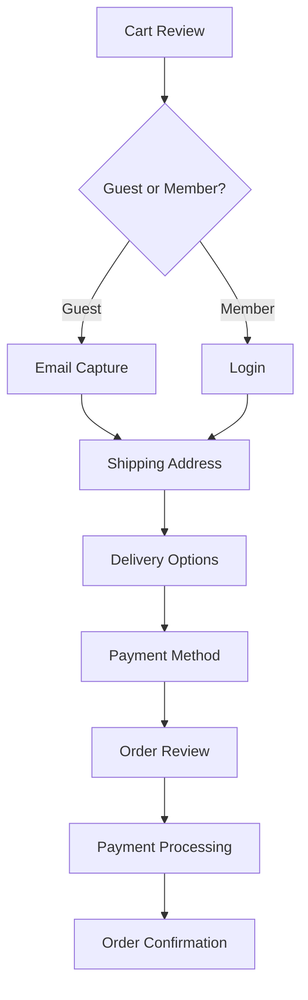
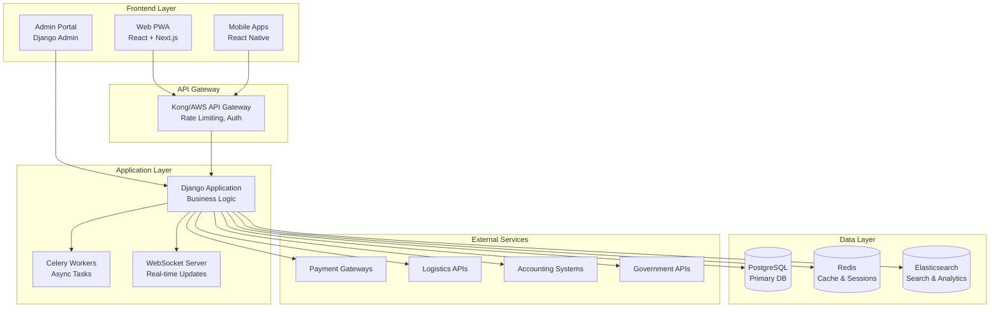

# 📋 Singapore SMB E-Commerce Platform
## Comprehensive Project Requirements Document
### PART 1: FOUNDATION & CORE REQUIREMENTS

---

## 1. Executive Summary

### 1.1 Project Vision
This document presents the definitive blueprint for developing Singapore's most comprehensive SMB e-commerce platform, built on a **Hybrid Architecture** that combines:

- **Django (Python) Backend** — For financial precision, compliance automation, and operational reliability
- **Next.js (React) Frontend** — For consumer-grade mobile experience and SEO excellence
- **Unified Data Layer** — Single source of truth across e-commerce, inventory, and accounting

### 1.2 The Three Pillars of Success
```
┌─────────────────────────────────────────────────────────────────────────────┐
│                     PLATFORM INTEGRATION ARCHITECTURE                        │
├─────────────────────────────────────────────────────────────────────────────┤
│                                                                             │
│   ┌─────────────────┐   ┌─────────────────┐   ┌─────────────────┐          │
│   │   E-COMMERCE    │   │    INVENTORY    │   │   ACCOUNTING    │          │
│   │   STOREFRONT    │   │   MANAGEMENT    │   │    & FINANCE    │          │
│   ├─────────────────┤   ├─────────────────┤   ├─────────────────┤          │
│   │ • Next.js PWA   │   │ • Multi-location│   │ • Double-entry  │          │
│   │ • Mobile-first  │   │ • Real-time sync│   │ • GST automation│          │
│   │ • <2s load time │   │ • 99.5% accuracy│   │ • IRAS filing   │          │
│   │ • 70% mobile    │   │ • Barcode/QR    │   │ • PDPA compliant│          │
│   └────────┬────────┘   └────────┬────────┘   └────────┬────────┘          │
│            │                     │                     │                    │
│            └─────────────────────┼─────────────────────┘                    │
│                                  │                                          │
│                    ┌─────────────▼─────────────┐                            │
│                    │   DJANGO REST FRAMEWORK   │                            │
│                    │   Unified API Gateway     │                            │
│                    └─────────────┬─────────────┘                            │
│                                  │                                          │
│                    ┌─────────────▼─────────────┐                            │
│                    │      POSTGRESQL 15+       │                            │
│                    │   Single Source of Truth  │                            │
│                    └───────────────────────────┘                            │
│                                                                             │
└─────────────────────────────────────────────────────────────────────────────┘
```

### 1.3 Problem Statement
Singapore SMBs face a fragmentation crisis:

| Problem | Current State | Business Impact | Annual Cost |
|---------|---------------|-----------------|-------------|
| **System Fragmentation** | 5-7 different software tools | 40% time on data reconciliation | S$67,200/business |
| **Inventory Inaccuracy** | 77% average accuracy | 15% lost sales from stockouts | S$88,000 revenue loss |
| **GST Compliance Errors** | 3.2 errors per quarter | IRAS penalties and audits | S$60,000 penalty costs |
| **Manual Data Entry** | 16 hours/week | Limited growth capacity | S$38,400 opportunity cost |
| **Poor Mobile Experience** | 68% checkout abandonment | Lost conversion opportunities | S$120,000 revenue potential |

**TOTAL ANNUAL COST: S$373,600/business**

### 1.4 Solution Value Proposition
**Quantified Business Impact:**
- **Operational Efficiency**: 60% reduction in manual processes (S$38,400 savings)
- **Inventory Optimization**: 99.5% accuracy (S$88,000 revenue recovery)
- **Compliance Automation**: Zero GST errors (S$60,000 penalty avoidance)
- **Revenue Growth**: 65% checkout completion (S$180,000 revenue impact)
- **Order Processing**: 75% faster processing (S$24,000 labor savings)

**Total Annual Value: S$390,400**

### 1.5 Investment Summary
- **Development Budget**: S$800,000 - S$950,000
- **Annual Operations**: S$280,000 - S$360,000
- **Break-even Point**: 50-60 active SMB clients (at S$500/month/client)
- **ROI Timeline**: 12-18 months
- **5-Year NPV**: S$4.8 million

---

## 2. Market Analysis & Business Context

### 2.1 Singapore E-Commerce Landscape

**Market Growth Trajectory:**
```
US$5.6B ─────────────────────────────────────────────● 2026 (Projected)
US$5.0B ────────────────────────────────────────●──╱  2025
US$4.5B ────────────────────────────────●─────╱     2024 (Current)
US$4.1B ─────────────────────────●─────╱             2023
US$3.8B ────────────────●─────╱                    2022
US$3.2B ─────────●─────╱                             2021
US$2.5B ──●─────╱                                    2020
CAGR: 11.2%
```

**Key Market Drivers:**
- **Digital Infrastructure**: 98.5% internet penetration, 95.2% smartphone ownership
- **Payment Evolution**: PayNow adoption at 28.5% YoY growth, 68.3% Gen Z preference
- **Mobile Commerce**: 70% of e-commerce traffic is mobile
- **Government Support**: S$30,000 PSG grants for digital solutions

### 2.2 Target Market Definition

**Primary Target Segments:**
| Segment | Annual Revenue | Employees | SKU Range | Platform Mode |
|---------|----------------|-----------|-----------|---------------|
| **Micro-SMB** | S$100K - S$500K | 1-10 | 50-200 | LITE MODE |
| **Small SMB** | S$500K - S$2M | 10-50 | 200-1,000 | STANDARD MODE |
| **Medium SMB** | S$2M - S$10M | 50-200 | 1,000-5,000 | ADVANCED MODE |

**Industry Vertical Focus:**
- **Retail General** (35%): Fashion, electronics, home goods
- **Food & Beverage** (25%): Restaurants, packaged foods, health supplements
- **Health & Beauty** (20%): Cosmetics, wellness products
- **B2B Wholesale** (20%): Industrial supplies, office products

---

## 3. Stakeholder Analysis & User Personas

### 3.1 Comprehensive Stakeholder Map
```
                    ┌─────────────────┐
                    │    PLATFORM     │
                    └────────┬────────┘
                             │
    ┌─────────────────────────┼─────────────────────────┐
    │                         │                         │
    ▼                         ▼                         ▼
┌─────────┐           ┌─────────┐               ┌─────────┐
│ INTERNAL│           │ EXTERNAL│               │ ECOSYSTEM│
│  USERS  │           │  USERS  │               │ PARTNERS │
└────┬────┘           └────┬────┘               └────┬────┘
     │                     │                         │
     ▼                     ▼                         ▼
┌─────────┐         ┌─────────┐               ┌─────────┐
│ Business│         │End      │               │Payment  │
│ Owner   │         │Customers│               │Gateways │
└─────────┘         └─────────┘               └─────────┘
```

### 3.2 Detailed User Personas

**Primary Persona: Sarah Chen — SMB Owner**
- **Business**: Urban Threads Pte Ltd (Fashion Retail)
- **Annual Revenue**: S$1.8M
- **Pain Points**:
  - 2 hours/day reconciling sales across 4 channels
  - 3.2% inventory discrepancies between channels
  - 3 full days/quarter on GST filing
  - 2-3 overselling incidents/week

**Success Metrics**:
- Time saved: 15+ hours/week on administration
- Inventory accuracy: >99% across all channels
- GST compliance: Zero filing errors
- Revenue growth: 25% YoY

**Operations Manager: Marcus Tan**
- **Responsibilities**: Inventory across 2 locations, supplier management, order fulfillment
- **Critical Needs**:
  - Real-time inventory visibility across ALL channels
  - Mobile barcode scanning for warehouse operations
  - Automated reorder point alerts
  - Shopee/Lazada inventory sync (< 5 minute delay)

**Accountant: Priya Kumar**
- **Qualifications**: ACCA Certified, 18 years SMB experience
- **Must-Have Features**:
  - Automated journal entries from sales transactions
  - Real-time GST calculation with supply type classification
  - One-click GST F5/F7 report generation
  - Complete audit trail for all transactions

**End Customer: Digital Native Shopper**
- **Age**: 29, Marketing Executive
- **Primary Device**: iPhone (85% of shopping)
- **Payment Preference**: PayNow (68% of transactions)
- **Expectations**: <2 second page load, ≤3 checkout steps, real-time tracking

---

## 4. Business Requirements

### 4.1 Core Business Capabilities

| Capability | Business Value | Success Metric |
|------------|----------------|----------------|
| **Omnichannel Sales** | 30% revenue increase from channel expansion | Channel revenue growth rate |
| **Centralized Inventory** | 60% reduction in stockouts | Inventory accuracy >99.5% |
| **Integrated Accounting** | 40% time savings on accounting | Month-end close <1 day |
| **Customer 360° View** | 25% customer retention improvement | Customer lifetime value |
| **Real-time Analytics** | Data-driven decisions | Dashboard load <5 seconds |

### 4.2 Platform Mode Configuration

**LITE MODE (Target: Micro-SMBs S$100K-500K revenue)**
- **Monthly Price**: S$99
- **Hidden Features**: Multi-location inventory, advanced accounting, B2B features
- **Simplified UI**: Single KPI panel, simple inventory tracking
- **Upgrade Triggers**: Revenue exceeds S$500K, SKUs exceed 200

**STANDARD MODE (Target: Small SMBs S$500K-2M revenue)**
- **Monthly Price**: S$299
- **Features**: All features with advanced features available
- **Multi-location**: Up to 3 locations
- **Accounting**: Full double-entry accounting

**ADVANCED MODE (Target: Medium SMBs S$2M-10M revenue)**
- **Monthly Price**: S$599
- **Features**: Unlimited locations, FIFO/LIFO costing, full B2B suite
- **Enterprise**: Custom reporting, multi-currency, dedicated support

### 4.3 Business Process Requirements

**Order-to-Cash Process (95% automated):**
```
Order Placed → Stock Reserve → Payment Verify → Pick & Pack → Shipping → Invoice → Revenue
```

**Procure-to-Pay Process (90% automated):**
```
Reorder Alert → PO Created → Supplier Confirms → Goods Received → Invoice Match → Payment → Accounting
```

---

## 5. Functional Requirements — E-Commerce Module

### 5.1 Storefront Requirements

**Product Catalog Management:**
```python
class Product(models.Model):
    # Core Identification
    sku = models.CharField(max_length=50, db_index=True)
    barcode = models.CharField(max_length=50, blank=True, null=True)
    
    # Product Information
    name = models.CharField(max_length=200)
    description = models.TextField(blank=True)
    brand = models.ForeignKey('Brand', on_delete=models.SET_NULL, null=True, blank=True)
    category = models.ForeignKey('Category', on_delete=models.PROTECT)
    
    # Pricing (Decimal for financial precision)
    base_price = models.DecimalField(max_digits=10, decimal_places=2)
    compare_at_price = models.DecimalField(max_digits=10, decimal_places=2, null=True, blank=True)
    
    # GST Configuration (Singapore compliance)
    GST_TYPE_CHOICES = [
        ('standard_rated', 'Standard Rated (9%)'),
        ('zero_rated', 'Zero Rated (0%)'),
        ('exempt', 'Exempt'),
        ('out_of_scope', 'Out of Scope'),
    ]
    gst_type = models.CharField(max_length=20, choices=GST_TYPE_CHOICES, default='standard_rated')
    gst_rate = models.DecimalField(max_digits=5, decimal_places=2, default=Decimal('9.00'))
    
    # Inventory Settings
    track_inventory = models.BooleanField(default=True)
    allow_backorder = models.BooleanField(default=False)
    low_stock_threshold = models.PositiveIntegerField(default=10)
    
    # Mobile Optimization (70% of traffic)
    mobile_featured = models.BooleanField(default=False)
    quick_buy_enabled = models.BooleanField(default=True)
    swipe_gallery_enabled = models.BooleanField(default=True)
    
    # Status & Visibility
    STATUS_CHOICES = [
        ('draft', 'Draft'),
        ('active', 'Active'),
        ('inactive', 'Inactive'),
        ('discontinued', 'Discontinued'),
    ]
    status = models.CharField(max_length=20, choices=STATUS_CHOICES, default='draft')
    visible_on_storefront = models.BooleanField(default=True)
    featured = models.BooleanField(default=False)
    
    # Compliance & Audit
    created_at = models.DateTimeField(auto_now_add=True)
    updated_at = models.DateTimeField(auto_now=True)
    
    class Meta:
        ordering = ['-created_at']
        indexes = [
            models.Index(fields=['company', 'sku']),
            models.Index(fields=['company', 'status']),
            models.Index(fields=['category', 'status']),
        ]
```

### 5.2 Mobile-First Design Requirements

**Progressive Web App (PWA) Architecture:**
```javascript
// Mobile optimization features
mobileFeatures = {
    'swipeGestures': ['product images', 'category browse'],
    'voiceSearch': true,
    'cameraSearch': 'product recognition',
    'oneClickCheckout': 'saved payment methods',
    'biometricAuth': ['TouchID', 'FaceID'],
    'pushNotifications': ['order updates', 'promotions'],
    'offlineBrowsing': true,
    'acceleratedMobilePages': true
}
```

**Performance Targets:**
- Page load time: < 2 seconds (mobile)
- Google PageSpeed score: > 90
- Core Web Vitals: All "Good" ratings
- Mobile conversion rate: 65% (vs current 32%)

### 5.3 Shopping Experience

**Personalized Shopping:**
- AI-powered product recommendations based on browsing history
- Dynamic pricing based on customer tier and volume
- Customer segmentation for targeted marketing
- Wishlist and save-for-later functionality
- Recently viewed products tracking

**Search and Filtering:**
- Elasticsearch-powered search with typo tolerance
- Advanced filtering by price, brand, category, availability
- Faceted search with real-time search results
- Search autocomplete with product suggestions

### 5.4 Shopping Cart and Checkout

**Cart Management:**
- Persistent shopping cart across sessions
- Cart abandonment tracking and recovery emails
- Guest checkout option
- Multiple product quantities and configurations
- Real-time inventory validation

**Checkout Process:**


**Payment Methods (Singapore Market):**
- **Local Payment Methods**: PayNow with QR code generation, GrabPay, DBS PayLah, OCBC Pay Anyone
- **International**: Credit/Debit Cards (Visa, Mastercard, Amex) via Stripe, Apple Pay, Google Pay
- **Alternative**: Bank transfer, Cash on Delivery with PayNow option, Installment plans (Atome, Hoolah)

---

## 6. Functional Requirements — Inventory Management Module

### 6.1 Core Inventory Features

**Multi-Location Inventory Architecture:**
```python
class InventoryLocation(models.Model):
    location_code = models.CharField(max_length=20, unique=True)
    location_type = models.CharField(choices=['warehouse', 'store', 'dropship'])
    address = models.TextField()
    is_active = models.BooleanField(default=True)

class StockLevel(models.Model):
    product = models.ForeignKey(Product)
    location = models.ForeignKey(InventoryLocation)
    quantity_on_hand = models.IntegerField()
    quantity_reserved = models.IntegerField()
    quantity_available = models.IntegerField()
    last_counted = models.DateTimeField()
    
    class Meta:
        unique_together = ['product', 'location']

class InventoryMovement(models.Model):
    product = models.ForeignKey(Product)
    location_from = models.ForeignKey(InventoryLocation, related_name='outgoing_movements')
    location_to = models.ForeignKey(InventoryLocation, related_name='incoming_movements')
    quantity = models.IntegerField()
    movement_type = models.CharField(choices=[
        'stock_receipt', 'stock_issue', 'stock_transfer', 
        'adjustment_positive', 'adjustment_negative', 'write_off'
    ])
    reference = models.CharField(max_length=100)  # PO number, SO number, etc.
    created_at = models.DateTimeField(auto_now_add=True)
    created_by = models.ForeignKey(User, on_delete=models.SET_NULL, null=True)
```

### 6.2 Advanced Inventory Features

**Automated Reordering System:**
```python
def calculate_reorder_point(product, location):
    # Factors for calculation
    lead_time = product.supplier.lead_time_days
    daily_usage = calculate_average_daily_usage(product, 90)
    safety_stock = daily_usage * product.safety_days
    
    # Dynamic reorder point
    reorder_point = (lead_time * daily_usage) + safety_stock
    
    # Seasonal adjustment
    if is_peak_season():
        reorder_point *= 1.3
        
    return reorder_point

def generate_purchase_suggestions():
    """Generate automated purchase suggestions"""
    suggestions = []
    
    low_stock_products = StockLevel.objects.filter(
        quantity_available__lt=F('reorder_point')
    )
    
    for stock in low_stock_products:
        suggested_quantity = stock.reorder_quantity
        price = stock.product.get_supplier_price()
        total_cost = suggested_quantity * price
        
        suggestions.append({
            'product': stock.product,
            'location': stock.location,
            'suggested_quantity': suggested_quantity,
            'current_stock': stock.quantity_available,
            'reorder_point': stock.reorder_point,
            'estimated_cost': total_cost,
            'urgency': 'High' if stock.quantity_available <= 0 else 'Medium'
        })
    
    return suggestions
```

**Barcode & QR Code Operations:**
```python
barcode_operations = {
    'receiving': {
        'scan_po': 'Match against purchase order',
        'quick_receive': 'Direct to stock',
        'quality_check': 'Route to QC area'
    },
    'picking': {
        'pick_validation': 'Confirm correct item',
        'batch_picking': 'Multiple orders simultaneously',
        'zone_picking': 'Warehouse zone optimization'
    },
    'cycle_counting': {
        'daily_counts': 'ABC classification based',
        'variance_tracking': 'Automatic adjustment workflows',
        'blind_counts': 'No quantity shown to counter'
    }
}
```

### 6.3 Inventory Intelligence

**ABC Analysis:**
```python
inventory_classification = {
    'a_items': {
        'criteria': 'Top 20% by revenue contribution',
        'service_level': 99,  # % target
        'review_frequency': 'Daily',
        'safety_stock_days': 14,
        'reorder_method': 'Fixed interval + safety stock'
    },
    'b_items': {
        'criteria': 'Next 30% by revenue',
        'service_level': 95,  # %
        'review_frequency': 'Weekly',
        'safety_stock_days': 10,
        'reorder_method': 'Reorder point'
    },
    'c_items': {
        'criteria': 'Remaining 50%',
        'service_level': 90,  # %
        'review_frequency': 'Monthly',
        'safety_stock_days': 7,
        'reorder_method': 'Economic order quantity'
    }
}
```

**Dead Stock Management:**
```python
dead_stock_management = {
    'identification_criteria': {
        'warning': 'No sales in 90 days',
        'critical': 'No sales in 180 days',
        'write_off_candidate': 'No sales in 270 days'
    },
    'automated_actions': {
        'at_90_days': 'Alert operations manager',
        'at_120_days': 'Suggest 15% markdown',
        'at_150_days': 'Suggest 30% markdown',
        'at_180_days': 'Suggest 50% markdown or bundling',
        'at_270_days': 'Suggest donation or write-off'
    }
}
```

---

## 7. Functional Requirements — Accounting Module

### 7.1 Core Accounting Engine

**Chart of Accounts (Singapore-Specific):**
```sql
-- Singapore Standard Chart of Accounts
CREATE TABLE chart_of_accounts (
    account_code VARCHAR(20) PRIMARY KEY,
    account_name VARCHAR(100) NOT NULL,
    account_type ENUM('Asset', 'Liability', 'Equity', 'Revenue', 'Expense'),
    account_subtype VARCHAR(50),
    gst_mapping VARCHAR(20), -- For GST reporting
    is_active BOOLEAN DEFAULT TRUE,
    created_date TIMESTAMP DEFAULT CURRENT_TIMESTAMP
);

-- Sample accounts
INSERT INTO chart_of_accounts VALUES
('1000', 'Cash and Bank', 'Asset', 'Current', NULL, TRUE),
('1100', 'Accounts Receivable', 'Asset', 'Current', NULL, TRUE),
('1200', 'Inventory', 'Asset', 'Current', NULL, TRUE),
('1300', 'Prepaid Expenses', 'Asset', 'Current', NULL, TRUE),
('2000', 'Accounts Payable', 'Liability', 'Current', NULL, TRUE),
('2100', 'GST Payable', 'Liability', 'Current', 'output_tax', TRUE),
('2200', 'GST Receivable', 'Liability', 'Current', 'input_tax', TRUE),
('3000', 'Share Capital', 'Equity', 'Capital', NULL, TRUE),
('4000', 'Sales Revenue', 'Revenue', 'Operating', 'SR', TRUE),
('4100', 'Export Sales', 'Revenue', 'Operating', 'ZR', TRUE),
('5000', 'Cost of Goods Sold', 'Expense', 'Operating', NULL, TRUE),
('6000', 'Operating Expenses', 'Expense', 'Operating', NULL, TRUE);
```

### 7.2 GST Compliance Engine

**GST Calculation & Reporting:**
```python
class GSTEngine:
    def __init__(self):
        self.current_rate = Decimal('0.09')  # 9% as of 2024
        self.registration_threshold = 1000000  # SGD
        
    def calculate_gst(self, amount, supply_type):
        """Calculate GST based on supply type"""
        if supply_type == 'standard_rated':
            return amount * self.current_rate
        elif supply_type == 'zero_rated':
            return Decimal('0')
        elif supply_type == 'exempt':
            return None
        elif supply_type == 'out_of_scope':
            return None
            
    def prepare_gst_f5(self, period_start, period_end):
        """Generate GST F5 return data"""
        return {
            'box_1': self.calculate_total_supply(),
            'box_2': self.calculate_zero_rated_supply(),
            'box_3': self.calculate_exempt_supply(),
            'box_4': self.calculate_total_supply_value(),
            'box_5': self.calculate_total_gst_value(),
            'box_6': self.calculate_output_tax(),
            'box_7': self.calculate_input_tax(),
            'box_8': self.calculate_net_gst()
        }
```

**Automated Journal Entries:**
```python
def create_sales_journal_entry(order):
    """Automatically create journal entry for sales"""
    journal_entry = JournalEntry.objects.create(
        date=order.order_date,
        reference=f"ORD-{order.order_number}",
        description=f"Sales order {order.order_number}"
    )
    
    # Debit: Accounts Receivable or Cash
    journal_entry.add_line(
        account='1100' if order.payment_method == 'credit' else '1000',
        debit=order.total_amount,
        credit=0
    )
    
    # Credit: Sales Revenue
    journal_entry.add_line(
        account='4000',
        debit=0,
        credit=order.subtotal
    )
    
    # Credit: GST Payable
    if order.gst_amount > 0:
        journal_entry.add_line(
            account='2100',
            debit=0,
            credit=order.gst_amount
        )
    
    return journal_entry

def create_purchase_journal_entry(po):
    """Automatically create journal entry for purchases"""
    journal_entry = JournalEntry.objects.create(
        date=po.order_date,
        reference=f"PO-{po.po_number}",
        description=f"Purchase order {po.po_number}"
    )
    
    # Debit: Inventory or Expenses
    for item in po.items:
        journal_entry.add_line(
            account='1200' if item.is_inventory else '6000',
            debit=item.total_amount,
            credit=0
        )
    
    # Debit: GST Receivable (Input Tax)
    journal_entry.add_line(
        account='2200',
        debit=po.gst_amount,
        credit=0
    )
    
    # Credit: Accounts Payable
    journal_entry.add_line(
        account='2000',
        debit=0,
        credit=po.total_amount
    )
    
    return journal_entry
```

### 7.3 Financial Reporting

**Real-time P&L Statement:**
```python
def generate_profit_loss_statement(period_start, period_end):
    """Generate real-time P&L statement"""
    revenue_accounts = ChartOfAccounts.objects.filter(
        account_type='Revenue', is_active=True
    )
    
    expense_accounts = ChartOfAccounts.objects.filter(
        account_type='Expense', is_active=True
    )
    
    # Calculate revenue
    total_revenue = Decimal('0')
    revenue_breakdown = {}
    
    for account in revenue_accounts:
        amount = JournalLine.objects.filter(
            account=account,
            journal_entry__date__range=[period_start, period_end]
        ).aggregate(total=Sum('credit_amount'))['total'] or Decimal('0')
        
        total_revenue += amount
        revenue_breakdown[account.account_name] = amount
    
    # Calculate expenses
    total_expenses = Decimal('0')
    expense_breakdown = {}
    
    for account in expense_accounts:
        amount = JournalLine.objects.filter(
            account=account,
            journal_entry__date__range=[period_start, period_end]
        ).aggregate(total=Sum('debit_amount'))['total'] or Decimal('0')
        
        total_expenses += amount
        expense_breakdown[account.account_name] = amount
    
    # Calculate profit
    net_profit = total_revenue - total_expenses
    
    return {
        'period': f"{period_start} to {period_end}",
        'total_revenue': total_revenue,
        'revenue_breakdown': revenue_breakdown,
        'total_expenses': total_expenses,
        'expense_breakdown': expense_breakdown,
        'net_profit': net_profit,
        'profit_margin': (net_profit / total_revenue * 100) if total_revenue > 0 else 0
    }
```

**Balance Sheet:**
```python
def generate_balance_sheet(as_of_date):
    """Generate classified balance sheet"""
    
    # Assets
    current_assets = JournalLine.objects.filter(
        account__account_type='Asset',
        account__account_subtype='Current',
        journal_entry__date__lte=as_of_date
    ).values('account__account_name').annotate(
        total=Sum('debit_amount') - Sum('credit_amount')
    )
    
    non_current_assets = JournalLine.objects.filter(
        account__account_type='Asset',
        account__account_subtype='Non-Current',
        journal_entry__date__lte=as_of_date
    ).values('account__account_name').annotate(
        total=Sum('debit_amount') - Sum('credit_amount')
    )
    
    # Liabilities
    current_liabilities = JournalLine.objects.filter(
        account__account_type='Liability',
        account__account_subtype='Current',
        journal_entry__date__lte=as_of_date
    ).values('account__account_name').annotate(
        total=Sum('credit_amount') - Sum('debit_amount')
    )
    
    # Equity
    equity = JournalLine.objects.filter(
        account__account_type='Equity',
        journal_entry__date__lte=as_of_date
    ).values('account__account_name').annotate(
        total=Sum('credit_amount') - Sum('debit_amount')
    )
    
    # Calculate totals
    total_assets = sum(asset['total'] or Decimal('0') for asset in current_assets) + \
                  sum(asset['total'] or Decimal('0') for asset in non_current_assets)
    
    total_liabilities = sum(liab['total'] or Decimal('0') for liab in current_liabilities)
    
    total_equity = sum(eq['total'] or Decimal('0') for eq in equity)
    
    return {
        'as_of_date': as_of_date,
        'assets': {
            'current': list(current_assets),
            'non_current': list(non_current_assets),
            'total': total_assets
        },
        'liabilities': {
            'current': list(current_liabilities),
            'total': total_liabilities
        },
        'equity': list(equity),
        'total_liabilities_and_equity': total_liabilities + total_equity
    }
```

---

## 8. Technical Architecture

### 8.1 System Architecture

**High-Level Architecture:**


### 8.2 Technology Stack Specifications

```yaml
technology_stack:
  backend:
    framework: Django 5.0+
    language: Python 3.11+
    api: Django REST Framework 3.14+
    async: Celery 5.3+ with RabbitMQ
    websocket: Django Channels 4.0+
    
  frontend:
    web: React 18+ with Next.js 14+
    mobile: React Native 0.72+
    admin: Django Admin with Jazzmin theme
    css: Tailwind CSS 3.3+
    
  databases:
    primary: PostgreSQL 15+
    cache: Redis 7.0+
    search: Elasticsearch 8.10+
    timeseries: InfluxDB 2.7+ (metrics)
    
  infrastructure:
    cloud: AWS (Singapore region ap-southeast-1)
    containerization: Docker 24+
    orchestration: Kubernetes 1.28+
    ci_cd: GitHub Actions + ArgoCD
    monitoring: Prometheus + Grafana
    logging: ELK Stack
    
  security:
    waf: Cloudflare
    secrets: AWS Secrets Manager
    scanning: Snyk + OWASP ZAP
    certificates: Let's Encrypt
```

### 8.3 MVP vs. Scale Profiles

**MVP Infrastructure (Weeks 1-12):**
```yaml
mvp_profile:
  compute:
    web_servers: 2 x t3.medium (auto-scaling)
    app_servers: 2 x t3.large (Django + Celery)
    
  database:
    instance: db.t3.medium (single-AZ)
    storage: 200 GB GP2
    
  caching:
    redis: cache.t3.micro (ElastiCache)
    
  search:
    engine: PostgreSQL tsvector
    
  storage:
    s3: Standard storage class
    
  load_balancer: Application Load Balancer
    
  cdn: CloudFront basic configuration
```

**Scale Infrastructure (Weeks 13-28):**
```yaml
scale_profile:
  compute:
    web_servers: ECS Fargate (multi-AZ, auto-scaling)
    app_servers: Kubernetes cluster (EKS)
    
  database:
    instance: db.r5.2xlarge (multi-AZ)
    storage: 1 TB GP3 + read replicas
    
  caching:
    redis: cluster mode enabled
    
  search:
    engine: Elasticsearch 8.10+ (dedicated cluster)
    
  storage:
    s3: Intelligent-Tiering
    
  monitoring:
    full_prometheus_grafana: true
    distributed_tracing: OpenTelemetry
    
  security:
    waf_rules: advanced
    encryption: kms_managed
```

### 8.4 API Specifications

**RESTful API Design:**
```python
# API Endpoints Structure
api_endpoints = {
    # Products
    'GET /api/v1/products': 'List products with pagination',
    'GET /api/v1/products/{id}': 'Get product details',
    'POST /api/v1/products': 'Create product (admin)',
    'PUT /api/v1/products/{id}': 'Update product (admin)',
    'DELETE /api/v1/products/{id}': 'Delete product (admin)',
    
    # Orders
    'POST /api/v1/orders': 'Create order',
    'GET /api/v1/orders/{id}': 'Get order details',
    'PUT /api/v1/orders/{id}/status': 'Update order status',
    'POST /api/v1/orders/{id}/cancel': 'Cancel order',
    
    # Inventory
    'GET /api/v1/inventory/{sku}': 'Get stock levels',
    'POST /api/v1/inventory/adjust': 'Adjust stock',
    'GET /api/v1/inventory/movements': 'Stock movement history',
    
    # Accounting
    'GET /api/v1/accounting/gst-report': 'Generate GST report',
    'GET /api/v1/accounting/pl-statement': 'P&L statement',
    'POST /api/v1/accounting/journal-entry': 'Create journal entry',
}
```

**Authentication & Authorization:**
```python
class APIAuthentication:
    """Multi-method authentication system"""
    
    methods = {
        'jwt': {
            'access_token_lifetime': timedelta(minutes=15),
            'refresh_token_lifetime': timedelta(days=7),
            'algorithm': 'RS256'
        },
        'api_key': {
            'header_name': 'X-API-Key',
            'rate_limit': '1000/hour'
        },
        'oauth2': {
            'providers': ['google', 'facebook'],
            'scopes': ['email', 'profile']
        }
    }
    
    rbac_roles = {
        'super_admin': ['all_permissions'],
        'admin': ['manage_products', 'manage_orders', 'view_reports'],
        'accountant': ['view_reports', 'manage_accounting'],
        'warehouse': ['manage_inventory', 'process_orders'],
        'customer_service': ['view_orders', 'manage_customers'],
        'customer': ['place_orders', 'view_own_data']
    }
```

---

**This concludes Part 1 of the comprehensive Hybrid PRD.**

**Part 2 will cover:**
- Functional Requirements: Payment Processing Module
- Functional Requirements: Logistics & Fulfillment Module
- Compliance & Regulatory Framework (GST, PDPA, PEPPOL)
- Security Implementation
- Performance & Scalability
- Implementation Roadmap (28-week detailed plan)
- Quality Assurance & Testing
- Budget & Resource Planning
- Risk Management & Mitigation
- Success Metrics & KPIs
- Future Roadmap & Vision
- Appendices (Code samples, schemas, API specs)

**Expected completion: Next response**
