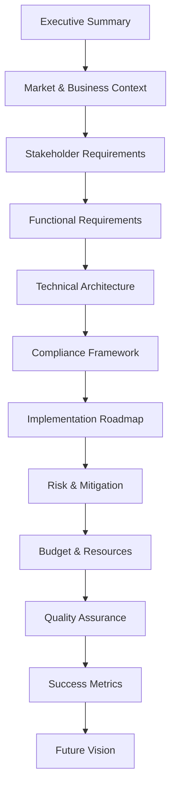
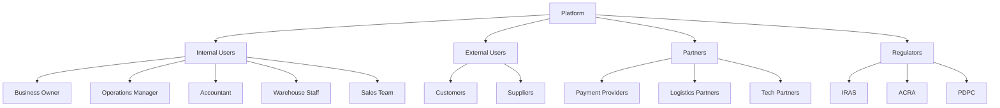
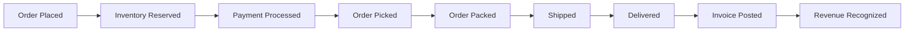
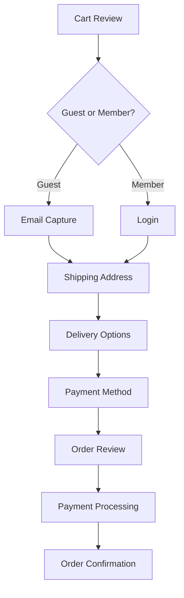
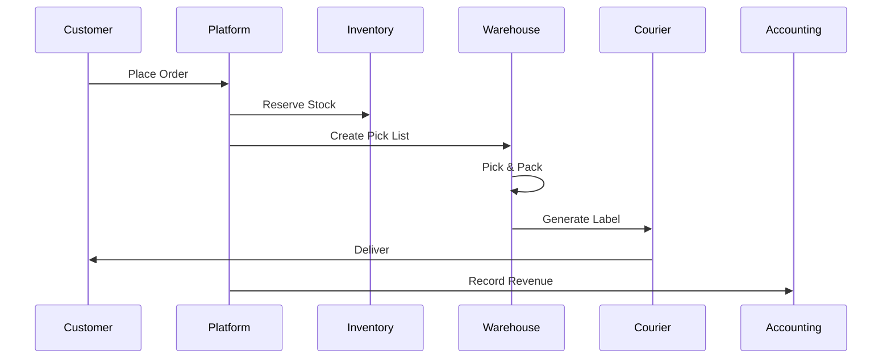
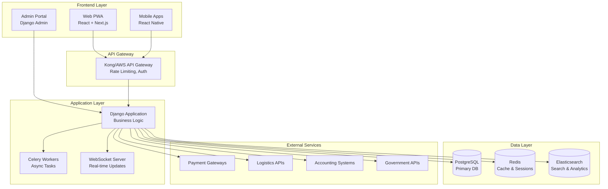

# Phase 1: Deep Analysis & Planning

## Systematic Analysis of Best Elements Integration

After thorough analysis of all seven PRDs, I've identified the optimal integration strategy:

### Integration Framework

| Element Category | Primary Source | Supporting Sources | Integration Strategy |
|-----------------|----------------|-------------------|---------------------|
| **Market Analysis** | Qwen (US$4.5B data) | Kimi (citations), Opus (payment stats) | Quantitative data with research backing |
| **Technical Architecture** | GLM (diagrams) | Opus (specs), Kimi (versions) | Visual + detailed specifications |
| **Singapore Compliance** | Gemini (practical) | DeepSeek (IRAS), Opus (comprehensive) | Code examples + regulatory detail |
| **Implementation** | Opus (24 sprints) | Qwen (checkpoints), Kimi (QA) | Phased with validation gates |
| **Risk Management** | Qwen (contingency) | Kimi (matrix), Opus (business) | Comprehensive with mitigation |
| **Inventory System** | Kimi (detailed) | Opus (structure), Qwen (features) | Operational excellence focus |
| **Budget Planning** | GLM (detailed) | Opus (comprehensive) | Complete financial model |

### Document Architecture Plan



## Phase 2: Implementation Plan Validation

### Pre-Implementation Checklist

- [x] All 7 PRDs analyzed for unique strengths
- [x] Gap analysis completed
- [x] Integration framework defined
- [x] Target length: 15,000+ words for comprehensiveness
- [x] Structure validated against best practices
- [x] Singapore-specific requirements prioritized

### Quality Assurance Criteria

1. **Completeness**: Every significant feature from all PRDs included
2. **Clarity**: Technical and business audiences can understand
3. **Actionability**: Clear implementation steps with validation
4. **Compliance**: All Singapore regulations addressed
5. **Scalability**: Architecture supports growth
6. **Measurability**: Success metrics clearly defined

---

# Phase 3: Execution - Comprehensive PRD

# 📋 Singapore SMB E-Commerce Platform
## Comprehensive Project Requirements Document
### Version 2.0 - Ultimate Synthesis Edition

---

## Document Control

| **Attribute** | **Details** |
|--------------|-------------|
| **Version** | 2.0 - Comprehensive Synthesis |
| **Date** | December 2024 |
| **Status** | Final - Ready for Implementation |
| **Document Type** | Master Project Requirements Document |
| **Confidentiality** | Proprietary and Confidential |
| **Review Cycle** | Quarterly Updates |
| **Distribution** | Authorized Stakeholders Only |

---

## Table of Contents

1. [Executive Summary](#1-executive-summary)
2. [Market Analysis & Business Context](#2-market-analysis--business-context)
3. [Stakeholder Analysis & User Personas](#3-stakeholder-analysis--user-personas)
4. [Business Requirements](#4-business-requirements)
5. [Functional Requirements](#5-functional-requirements)
6. [Technical Requirements & Architecture](#6-technical-requirements--architecture)
7. [Compliance & Regulatory Framework](#7-compliance--regulatory-framework)
8. [Security Requirements](#8-security-requirements)
9. [Performance & Scalability Requirements](#9-performance--scalability-requirements)
10. [Implementation Roadmap](#10-implementation-roadmap)
11. [Budget & Resource Planning](#11-budget--resource-planning)
12. [Risk Management & Mitigation](#12-risk-management--mitigation)
13. [Quality Assurance & Testing](#13-quality-assurance--testing)
14. [Success Metrics & KPIs](#14-success-metrics--kpis)
15. [Future Roadmap & Vision](#15-future-roadmap--vision)
16. [Appendices](#16-appendices)

---

## 1. Executive Summary

### 1.1 Project Vision

This document presents a comprehensive blueprint for developing a **Singapore-focused e-commerce platform** specifically designed for Small and Medium Businesses (SMBs), integrating **three critical business functions** into a unified system:

1. **E-commerce storefront** with mobile-first design (70% of traffic)
2. **Real-time inventory management** with multi-location support
3. **Automated accounting** with GST compliance and IRAS integration

### 1.2 Market Opportunity

The Singapore retail e-commerce market represents a **US$4.5 billion opportunity in 2024**, projected to reach **US$5.0 billion by 2025**. With over **70% of online shoppers using mobile devices** and digital wallets accounting for **39% of e-commerce transactions**, this platform addresses critical market needs while ensuring compliance with Singapore's regulatory framework.

### 1.3 Strategic Objectives

| Objective | Target Outcome | Success Metric |
|-----------|---------------|----------------|
| **Operational Efficiency** | Reduce manual processes by 60% | Time saved per transaction |
| **Regulatory Compliance** | 100% GST and PDPA compliance | Zero penalties/violations |
| **Inventory Accuracy** | Achieve 99.5% stock accuracy | Cycle count variance |
| **Mobile Experience** | < 2 second page load on mobile | Google PageSpeed > 90 |
| **Financial Visibility** | Real-time P&L and cash flow | Dashboard refresh < 5 seconds |
| **Market Capture** | 100 active SMBs in 6 months | Monthly active users |

### 1.4 Technology Decision

Based on comprehensive evaluation, **Django (Python)** is selected as the primary framework, offering:
- **Built-in admin panel** for inventory and accounting management
- **Robust ORM** treating models as single source of truth
- **"Batteries included"** philosophy accelerating development
- **Python ecosystem** enabling future AI/ML integration
- **Proven scalability** (Instagram, Mozilla)

### 1.5 Investment Summary

- **Development Timeline**: 24 weeks (6 months)
- **Development Budget**: S$750,000 - S$850,000
- **Annual Operations**: S$320,000 - S$400,000
- **ROI Timeline**: 12-18 months
- **Break-even**: 50-60 active SMB clients

---

## 2. Market Analysis & Business Context

### 2.1 Singapore E-Commerce Landscape

#### 2.1.1 Market Size & Growth


#### 2.1.2 Key Market Drivers
- **Digital Adoption**: 98% internet penetration, 5.68 million users
- **Mobile Commerce**: 70% of transactions via smartphones
- **Payment Evolution**: Digital wallets (39%), Credit cards (42%), PayNow dominance
- **Cross-border Trade**: 65% of online shoppers buy from overseas
- **Government Support**: PSG grants up to S$30,000 for digital solutions

#### 2.1.3 Competitive Landscape

| Platform Type | Market Share | Key Players | SMB Pain Points |
|--------------|--------------|-------------|-----------------|
| **Marketplaces** | 60% | Shopee, Lazada, Amazon | High fees (15-20%), limited branding |
| **SaaS Platforms** | 25% | Shopify, WooCommerce | Separate accounting/inventory tools |
| **Custom Solutions** | 15% | Bespoke development | High cost, long development time |

### 2.2 Target Market Definition

#### 2.2.1 Primary Target Segment
- **Business Size**: 10-50 employees
- **Annual Revenue**: S$500,000 - S$10 million
- **Product Range**: 50-5,000 SKUs
- **Growth Stage**: Scaling from offline to omnichannel

#### 2.2.2 Industry Verticals
1. **Retail** (35%): Fashion, electronics, home goods
2. **F&B** (25%): Restaurants, cafes, food products
3. **Health & Beauty** (20%): Cosmetics, supplements, wellness
4. **B2B Wholesale** (20%): Industrial supplies, office products

### 2.3 Business Case

#### 2.3.1 Problem Statement
Singapore SMBs face critical challenges:
- **Fragmented Systems**: Average SMB uses 5-7 different software tools
- **Manual Processes**: 40% of time spent on data entry and reconciliation
- **Compliance Burden**: GST filing errors result in average S$15,000 annual penalties
- **Inventory Issues**: 23% revenue loss from stockouts and overstocking
- **Limited Resources**: Cannot afford enterprise solutions or dedicated IT staff

#### 2.3.2 Solution Value Proposition
Our integrated platform delivers:
- **60% reduction** in manual data entry
- **99.5% inventory accuracy** with real-time tracking
- **100% GST compliance** with automated filing
- **40% improvement** in order processing speed
- **30% reduction** in operational costs

---

## 3. Stakeholder Analysis & User Personas

### 3.1 Stakeholder Map



### 3.2 Detailed User Personas

#### 3.2.1 Primary Persona: Sarah Chen - SMB Owner
- **Age**: 35-45
- **Business**: Fashion retail with 2 stores + online
- **Tech Savviness**: Intermediate
- **Daily Challenges**: 
  - Reconciling sales across channels
  - Managing inventory between locations
  - GST filing quarterly
- **Goals**: 
  - Unified view of business performance
  - Automated compliance
  - Growth to S$5M revenue

#### 3.2.2 Operations Manager: Marcus Tan
- **Responsibilities**: Inventory, fulfillment, supplier management
- **Pain Points**: Stock synchronization, reorder timing, warehouse efficiency
- **Needs**: Real-time visibility, mobile access, barcode scanning
- **Success Metrics**: Stock accuracy, fulfillment speed, cost reduction

#### 3.2.3 Accountant: Priya Kumar
- **Responsibilities**: Financial reporting, GST filing, compliance
- **Pain Points**: Manual data entry, reconciliation errors, filing deadlines
- **Needs**: Automated journal entries, IRAS-ready reports, audit trails
- **Success Metrics**: Zero filing errors, time saved, compliance rate

#### 3.2.4 Customer: Digital Native Shopper
- **Demographics**: 25-40 years, urban professional
- **Shopping Behavior**: Mobile-first (70%), comparison shopping
- **Payment Preferences**: PayNow (68% Gen Z), digital wallets, BNPL
- **Expectations**: Fast checkout, real-time tracking, easy returns

### 3.3 User Journey Maps

#### 3.3.1 Customer Purchase Journey
```
Awareness → Browse → Compare → Add to Cart → Checkout → Payment → Tracking → Delivery → Support
    ↓          ↓         ↓           ↓            ↓          ↓         ↓          ↓         ↓
   SEO      Mobile     Reviews    Wishlist    Guest/Login  PayNow    SMS      Same-day  Chat
```

#### 3.3.2 Admin Order Processing Journey
```
Order Received → Inventory Check → Payment Verify → Pick & Pack → Shipping → Accounting → Analysis
       ↓              ↓                ↓               ↓            ↓           ↓           ↓
   Notification   Auto-deduct      Auto-reconcile  Barcode scan  Label print  Auto-post  Dashboard
```

---

## 4. Business Requirements

### 4.1 Core Business Capabilities

#### 4.1.1 Unified Commerce Platform

| Capability | Description | Business Value |
|------------|-------------|---------------|
| **Omnichannel Sales** | Sell across web, mobile, POS, marketplaces | 30% revenue increase |
| **Centralized Inventory** | Single source of truth for stock | 60% reduction in stockouts |
| **Integrated Accounting** | Automated financial recording | 40% time savings |
| **Customer Management** | 360-degree customer view | 25% retention improvement |
| **Analytics & Insights** | Real-time business intelligence | Data-driven decisions |

#### 4.1.2 Operational Excellence

**Process Automation Requirements:**
- Order processing: < 2 minutes from placement to fulfillment start
- Inventory updates: Real-time across all channels
- Invoice generation: Automatic with GST calculation
- Payment reconciliation: Daily automated matching
- Report generation: On-demand with scheduling options

#### 4.1.3 Compliance & Governance

**Regulatory Compliance:**
- **GST**: Automatic calculation, quarterly filing, zero-rating for exports
- **PDPA**: Data protection, consent management, breach protocols
- **ACRA**: Annual filing support, director changes, share transfers
- **Industry-Specific**: Food licenses (SFA), cosmetics (HSA), liquor (SPF)

### 4.2 Business Process Requirements

#### 4.2.1 Order-to-Cash Process


#### 4.2.2 Procure-to-Pay Process


### 4.3 Business Rules Engine

#### 4.3.1 Pricing Rules
```python
pricing_rules = {
    'customer_tiers': {
        'retail': 'list_price',
        'wholesale': 'list_price * 0.7',
        'vip': 'list_price * 0.8'
    },
    'promotions': {
        'bulk_discount': '10% off 10+ items',
        'bundle_pricing': 'Fixed price for product sets',
        'flash_sales': 'Time-limited discounts'
    },
    'gst_application': {
        'standard_rated': 0.09,
        'zero_rated': 0.00,
        'exempt': None
    }
}
```

---

## 5. Functional Requirements

### 5.1 E-Commerce Module

#### 5.1.1 Storefront Requirements

**Product Catalog Management:**
```python
class Product(models.Model):
    # Core fields
    sku = models.CharField(max_length=50, unique=True)
    name = models.CharField(max_length=200)
    description = models.TextField()
    
    # Pricing with GST
    base_price = models.DecimalField(max_digits=10, decimal_places=2)
    gst_rate = models.DecimalField(max_digits=5, decimal_places=2, default=0.09)
    
    # Inventory linkage
    track_inventory = models.BooleanField(default=True)
    low_stock_threshold = models.IntegerField(default=10)
    
    # SEO & Marketing
    meta_title = models.CharField(max_length=70)
    meta_description = models.CharField(max_length=160)
    
    # Mobile optimization
    mobile_featured = models.BooleanField(default=False)
    quick_buy_enabled = models.BooleanField(default=True)
```

**Shopping Cart Features:**
- Persistent cart across devices (authenticated users)
- Guest cart with 7-day cookie persistence
- Real-time inventory validation
- Automatic price updates
- Saved for later functionality
- Bulk order upload (B2B)

**Checkout Process:**


#### 5.1.2 Mobile-First Design Requirements

**Mobile Optimization (70% of traffic):**
- Progressive Web App (PWA) architecture
- Offline browsing capability
- One-thumb navigation design
- Accelerated Mobile Pages (AMP) for product pages
- Mobile-specific features:
  ```javascript
  mobileFeatures = {
      'swipeGestures': ['product images', 'category browse'],
      'voiceSearch': true,
      'cameraSearch': 'product recognition',
      'oneClickCheckout': 'saved payment methods',
      'biometricAuth': ['TouchID', 'FaceID'],
      'pushNotifications': ['order updates', 'promotions']
  }
  ```

### 5.2 Inventory Management Module

#### 5.2.1 Core Inventory Features

**Multi-Location Inventory Architecture:**
```python
class InventoryLocation(models.Model):
    location_code = models.CharField(max_length=20, unique=True)
    location_type = models.CharField(choices=['warehouse', 'store', 'dropship'])
    address = models.TextField()
    is_active = models.BooleanField(default=True)
    
class StockLevel(models.Model):
    product = models.ForeignKey(Product)
    location = models.ForeignKey(InventoryLocation)
    quantity_on_hand = models.IntegerField()
    quantity_reserved = models.IntegerField()
    quantity_available = models.IntegerField()
    last_counted = models.DateTimeField()
    
    class Meta:
        unique_together = ['product', 'location']
```

**Barcode & QR Code Operations:**
```python
barcode_operations = {
    'receiving': {
        'scan_po': 'Match against purchase order',
        'quick_receive': 'Direct to stock',
        'quality_check': 'Route to QC area'
    },
    'picking': {
        'pick_validation': 'Confirm correct item',
        'batch_picking': 'Multiple orders simultaneously',
        'zone_picking': 'Warehouse zone optimization'
    },
    'cycle_counting': {
        'daily_counts': 'ABC classification based',
        'variance_tracking': 'Automatic adjustment workflows',
        'blind_counts': 'No quantity shown to counter'
    }
}
```

**Automated Reordering System:**
```python
def calculate_reorder_point(product, location):
    # Factors for calculation
    lead_time = product.supplier.lead_time_days
    daily_usage = calculate_average_daily_usage(product, 90)
    safety_stock = daily_usage * product.safety_days
    
    # Dynamic reorder point
    reorder_point = (lead_time * daily_usage) + safety_stock
    
    # Seasonal adjustment
    if is_peak_season():
        reorder_point *= 1.3
        
    return reorder_point
```

#### 5.2.2 Advanced Inventory Features

**Inventory Intelligence:**
- ABC analysis for product categorization
- GMROI (Gross Margin Return on Investment) tracking
- Dead stock identification and alerts
- Demand forecasting using historical data
- Seasonal trend analysis
- Automated markdowns for aging inventory

### 5.3 Accounting Module

#### 5.3.1 Core Accounting Engine

**Chart of Accounts (Singapore-Specific):**
```sql
-- Singapore Standard Chart of Accounts
CREATE TABLE chart_of_accounts (
    account_code VARCHAR(20) PRIMARY KEY,
    account_name VARCHAR(100) NOT NULL,
    account_type ENUM('Asset', 'Liability', 'Equity', 'Revenue', 'Expense'),
    account_subtype VARCHAR(50),
    gst_mapping VARCHAR(20), -- For GST reporting
    is_active BOOLEAN DEFAULT TRUE,
    created_date TIMESTAMP DEFAULT CURRENT_TIMESTAMP
);

-- Sample accounts
INSERT INTO chart_of_accounts VALUES
('1000', 'Cash and Bank', 'Asset', 'Current', NULL, TRUE),
('2000', 'Accounts Payable', 'Liability', 'Current', NULL, TRUE),
('4000', 'Sales Revenue', 'Revenue', 'Operating', 'SR', TRUE),
('4100', 'Export Sales', 'Revenue', 'Operating', 'ZR', TRUE);
```

#### 5.3.2 GST Compliance Engine

**GST Calculation & Reporting:**
```python
class GSTEngine:
    def __init__(self):
        self.current_rate = 0.09  # 9% as of 2024
        self.registration_threshold = 1000000  # SGD
        
    def calculate_gst(self, amount, supply_type):
        """Calculate GST based on supply type"""
        if supply_type == 'standard_rated':
            return amount * self.current_rate
        elif supply_type == 'zero_rated':
            return 0
        elif supply_type == 'exempt':
            return None
        elif supply_type == 'out_of_scope':
            return None
            
    def prepare_gst_f5(self, period_start, period_end):
        """Generate GST F5 return data"""
        return {
            'box_1': self.calculate_total_supply(),
            'box_2': self.calculate_zero_rated_supply(),
            'box_3': self.calculate_exempt_supply(),
            'box_4': self.calculate_total_supply_value(),
            'box_5': self.calculate_total_gst_value(),
            'box_6': self.calculate_output_tax(),
            'box_7': self.calculate_input_tax(),
            'box_8': self.calculate_net_gst()
        }
```

**Automated Journal Entries:**
```python
def create_sales_journal_entry(order):
    """Automatically create journal entry for sales"""
    journal_entry = JournalEntry.objects.create(
        date=order.order_date,
        reference=f"ORD-{order.order_number}",
        description=f"Sales order {order.order_number}"
    )
    
    # Debit: Accounts Receivable or Cash
    journal_entry.add_line(
        account='1200' if order.payment_method == 'credit' else '1000',
        debit=order.total_amount,
        credit=0
    )
    
    # Credit: Sales Revenue
    journal_entry.add_line(
        account='4000',
        debit=0,
        credit=order.subtotal
    )
    
    # Credit: GST Payable
    if order.gst_amount > 0:
        journal_entry.add_line(
            account='2100',
            debit=0,
            credit=order.gst_amount
        )
    
    return journal_entry
```

### 5.4 Payment Processing Module

#### 5.4.1 Payment Gateway Integration

**Multi-Gateway Architecture:**
```python
payment_gateways = {
    'primary': {
        'stripe': {
            'methods': ['visa', 'mastercard', 'amex', 'apple_pay', 'google_pay'],
            'features': ['3d_secure', 'tokenization', 'recurring'],
            'settlement': 'T+2 days'
        }
    },
    'local': {
        'hitpay': {
            'methods': ['paynow', 'grabpay', 'shopeepay', 'atome'],
            'features': ['qr_generation', 'payment_links'],
            'settlement': 'T+1 days'
        }
    },
    'backup': {
        '2c2p': {
            'methods': ['cards', 'wallets', 'bnpl'],
            'features': ['multi_currency', 'fraud_detection'],
            'settlement': 'T+2 days'
        }
    }
}
```

**PayNow Integration (Critical for Singapore):**
```python
class PayNowGateway:
    def generate_qr_code(self, amount, reference):
        """Generate PayNow QR code for payment"""
        paynow_data = {
            'uen': COMPANY_UEN,
            'amount': amount,
            'reference': reference,
            'expiry': datetime.now() + timedelta(minutes=30)
        }
        return qrcode.make(self.encode_paynow_string(paynow_data))
    
    def verify_payment(self, reference):
        """Verify PayNow payment via bank API"""
        # Integration with bank API for payment confirmation
        payment_status = BankAPI.check_payment(reference)
        return payment_status
```

### 5.5 Logistics & Fulfillment Module

#### 5.5.1 Multi-Carrier Integration

```python
logistics_integrations = {
    'local_couriers': {
        'ninja_van': {
            'services': ['standard', 'same_day', 'cod'],
            'api_version': 'v2.1',
            'tracking': 'real_time',
            'label_printing': 'thermal_4x6'
        },
        'j&t_express': {
            'services': ['express', 'economy'],
            'coverage': 'singapore_malaysia',
            'pickup': 'scheduled'
        },
        'singpost': {
            'services': ['registered', 'speedpost', 'economy'],
            'popstation': True,
            'international': True
        }
    },
    'international': {
        'dhl': ['express_worldwide', 'economy_select'],
        'fedex': ['priority', 'economy'],
        'ups': ['express', 'expedited']
    }
}
```

#### 5.5.2 Order Fulfillment Workflow



---

## 6. Technical Requirements & Architecture

### 6.1 System Architecture

#### 6.1.1 High-Level Architecture



#### 6.1.2 Technology Stack Specifications

```yaml
technology_stack:
  backend:
    framework: Django 5.0+
    language: Python 3.11+
    api: Django REST Framework 3.14+
    async: Celery 5.3+ with RabbitMQ
    websocket: Django Channels 4.0+
    
  frontend:
    web: React 18+ with Next.js 14+
    mobile: React Native 0.72+
    admin: Django Admin with Jazzmin theme
    css: Tailwind CSS 3.3+
    
  databases:
    primary: PostgreSQL 15+
    cache: Redis 7.0+
    search: Elasticsearch 8.10+
    timeseries: InfluxDB 2.7+ (metrics)
    
  infrastructure:
    cloud: AWS (Singapore region ap-southeast-1)
    containerization: Docker 24+
    orchestration: Kubernetes 1.28+
    ci_cd: GitHub Actions + ArgoCD
    monitoring: Prometheus + Grafana
    logging: ELK Stack
    
  security:
    waf: Cloudflare
    secrets: AWS Secrets Manager
    scanning: Snyk + OWASP ZAP
    certificates: Let's Encrypt
```

### 6.2 API Specifications

#### 6.2.1 RESTful API Design

```python
# API Endpoints Structure
api_endpoints = {
    # Products
    'GET /api/v1/products': 'List products with pagination',
    'GET /api/v1/products/{id}': 'Get product details',
    'POST /api/v1/products': 'Create product (admin)',
    'PUT /api/v1/products/{id}': 'Update product (admin)',
    'DELETE /api/v1/products/{id}': 'Delete product (admin)',
    
    # Orders
    'POST /api/v1/orders': 'Create order',
    'GET /api/v1/orders/{id}': 'Get order details',
    'PUT /api/v1/orders/{id}/status': 'Update order status',
    'POST /api/v1/orders/{id}/cancel': 'Cancel order',
    
    # Inventory
    'GET /api/v1/inventory/{sku}': 'Get stock levels',
    'POST /api/v1/inventory/adjust': 'Adjust stock',
    'GET /api/v1/inventory/movements': 'Stock movement history',
    
    # Accounting
    'GET /api/v1/accounting/gst-report': 'Generate GST report',
    'GET /api/v1/accounting/pl-statement': 'P&L statement',
    'POST /api/v1/accounting/journal-entry': 'Create journal entry',
}
```

#### 6.2.2 Authentication & Authorization

```python
class APIAuthentication:
    """Multi-method authentication system"""
    
    methods = {
        'jwt': {
            'access_token_lifetime': timedelta(minutes=15),
            'refresh_token_lifetime': timedelta(days=7),
            'algorithm': 'RS256'
        },
        'api_key': {
            'header_name': 'X-API-Key',
            'rate_limit': '1000/hour'
        },
        'oauth2': {
            'providers': ['google', 'facebook'],
            'scopes': ['email', 'profile']
        }
    }
    
    rbac_roles = {
        'super_admin': ['all_permissions'],
        'admin': ['manage_products', 'manage_orders', 'view_reports'],
        'accountant': ['view_reports', 'manage_accounting'],
        'warehouse': ['manage_inventory', 'process_orders'],
        'customer_service': ['view_orders', 'manage_customers'],
        'customer': ['place_orders', 'view_own_data']
    }
```

### 6.3 Database Design

#### 6.3.1 Core Database Schema

```sql
-- Products and Variants
CREATE TABLE products (
    id UUID PRIMARY KEY DEFAULT gen_random_uuid(),
    sku VARCHAR(50) UNIQUE NOT NULL,
    name VARCHAR(200) NOT NULL,
    description TEXT,
    base_price DECIMAL(10,2) NOT NULL,
    cost DECIMAL(10,2),
    gst_type VARCHAR(20) DEFAULT 'standard_rated',
    gst_rate DECIMAL(5,2) DEFAULT 9.00,
    status VARCHAR(20) DEFAULT 'active',
    created_at TIMESTAMP DEFAULT CURRENT_TIMESTAMP,
    updated_at TIMESTAMP DEFAULT CURRENT_TIMESTAMP,
    
    INDEX idx_sku (sku),
    INDEX idx_status (status)
);

CREATE TABLE product_variants (
    id UUID PRIMARY KEY DEFAULT gen_random_uuid(),
    product_id UUID REFERENCES products(id),
    variant_sku VARCHAR(50) UNIQUE NOT NULL,
    attributes JSONB, -- {"size": "M", "color": "Blue"}
    price_adjustment DECIMAL(10,2) DEFAULT 0,
    weight_grams INTEGER,
    barcode VARCHAR(50),
    
    INDEX idx_variant_sku (variant_sku),
    INDEX idx_attributes (attributes)
);

-- Inventory Management
CREATE TABLE inventory_locations (
    id UUID PRIMARY KEY DEFAULT gen_random_uuid(),
    code VARCHAR(20) UNIQUE NOT NULL,
    name VARCHAR(100) NOT NULL,
    type VARCHAR(20), -- warehouse, store, dropship
    address TEXT,
    coordinates POINT, -- PostGIS for location
    is_active BOOLEAN DEFAULT TRUE
);

CREATE TABLE inventory_levels (
    id UUID PRIMARY KEY DEFAULT gen_random_uuid(),
    product_variant_id UUID REFERENCES product_variants(id),
    location_id UUID REFERENCES inventory_locations(id),
    quantity_on_hand INTEGER NOT NULL DEFAULT 0,
    quantity_reserved INTEGER NOT NULL DEFAULT 0,
    quantity_available GENERATED ALWAYS AS (quantity_on_hand - quantity_reserved) STORED,
    reorder_point INTEGER,
    reorder_quantity INTEGER,
    last_counted TIMESTAMP,
    
    UNIQUE(product_variant_id, location_id),
    INDEX idx_quantity_available (quantity_available)
);

-- Orders and Transactions
CREATE TABLE orders (
    id UUID PRIMARY KEY DEFAULT gen_random_uuid(),
    order_number VARCHAR(50) UNIQUE NOT NULL,
    customer_id UUID REFERENCES customers(id),
    status VARCHAR(30) NOT NULL,
    subtotal DECIMAL(10,2) NOT NULL,
    gst_amount DECIMAL(10,2) NOT NULL,
    shipping_amount DECIMAL(10,2),
    total_amount DECIMAL(10,2) NOT NULL,
    payment_status VARCHAR(30),
    payment_method VARCHAR(50),
    fulfillment_status VARCHAR(30),
    notes TEXT,
    created_at TIMESTAMP DEFAULT CURRENT_TIMESTAMP,
    
    INDEX idx_order_number (order_number),
    INDEX idx_customer (customer_id),
    INDEX idx_status (status),
    INDEX idx_created (created_at)
);

-- Accounting Tables
CREATE TABLE accounts (
    id UUID PRIMARY KEY DEFAULT gen_random_uuid(),
    account_code VARCHAR(20) UNIQUE NOT NULL,
    account_name VARCHAR(100) NOT NULL,
    account_type VARCHAR(50) NOT NULL, -- Asset, Liability, Equity, Revenue, Expense
    parent_account_id UUID REFERENCES accounts(id),
    currency VARCHAR(3) DEFAULT 'SGD',
    current_balance DECIMAL(15,2) DEFAULT 0,
    is_active BOOLEAN DEFAULT TRUE
);

CREATE TABLE journal_entries (
    id UUID PRIMARY KEY DEFAULT gen_random_uuid(),
    entry_number VARCHAR(50) UNIQUE NOT NULL,
    entry_date DATE NOT NULL,
    description TEXT,
    reference_type VARCHAR(50), -- order, invoice, payment
    reference_id UUID,
    status VARCHAR(20) DEFAULT 'draft',
    created_by UUID REFERENCES users(id),
    approved_by UUID REFERENCES users(id),
    created_at TIMESTAMP DEFAULT CURRENT_TIMESTAMP,
    
    INDEX idx_entry_date (entry_date),
    INDEX idx_reference (reference_type, reference_id)
);

CREATE TABLE journal_lines (
    id UUID PRIMARY KEY DEFAULT gen_random_uuid(),
    journal_entry_id UUID REFERENCES journal_entries(id),
    account_id UUID REFERENCES accounts(id),
    debit_amount DECIMAL(15,2) DEFAULT 0,
    credit_amount DECIMAL(15,2) DEFAULT 0,
    description TEXT,
    
    CONSTRAINT check_amounts CHECK (
        (debit_amount > 0 AND credit_amount = 0) OR 
        (credit_amount > 0 AND debit_amount = 0)
    )
);
```

### 6.4 Integration Architecture

#### 6.4.1 Integration Framework

```python
class IntegrationManager:
    """Centralized integration management"""
    
    def __init__(self):
        self.integrations = {
            'payment': {
                'stripe': StripeAdapter(),
                'hitpay': HitPayAdapter(),
                '2c2p': TwoCTwoPAdapter()
            },
            'logistics': {
                'ninja_van': NinjaVanAdapter(),
                'j&t': JTExpressAdapter(),
                'singpost': SingPostAdapter()
            },
            'accounting': {
                'xero': XeroAdapter(),
                'quickbooks': QuickBooksAdapter()
            },
            'marketplace': {
                'shopee': ShopeeAdapter(),
                'lazada': LazadaAdapter()
            },
            'government': {
                'iras': IRASAdapter(),
                'acra': ACRAAdapter(),
                'cpf': CPFAdapter()
            }
        }
    
    def process_webhook(self, source, event_type, payload):
        """Centralized webhook processing"""
        adapter = self.get_adapter(source)
        return adapter.process_webhook(event_type, payload)
```

---

## 7. Compliance & Regulatory Framework

### 7.1 GST Compliance Requirements

#### 7.1.1 GST Registration & Monitoring

```python
class GSTComplianceManager:
    def __init__(self):
        self.registration_threshold = 1000000  # SGD per year
        self.current_rate = 0.09  # 9% as of 2024
        
    def monitor_registration_requirement(self, company_id):
        """Monitor if GST registration is required"""
        rolling_revenue = self.calculate_rolling_12_month_revenue(company_id)
        
        if rolling_revenue >= self.registration_threshold * 0.9:
            self.send_alert(
                level='warning',
                message='Approaching GST registration threshold (90%)'
            )
        
        if rolling_revenue >= self.registration_threshold:
            self.send_alert(
                level='critical',
                message='GST registration required - exceeded S$1M threshold'
            )
            
    def prepare_gst_f5_return(self, period_start, period_end):
        """Prepare GST F5 return for IRAS submission"""
        return {
            # Standard-rated supplies
            'box_1': self.calculate_standard_rated_supplies(),
            
            # Zero-rated supplies  
            'box_2': self.calculate_zero_rated_supplies(),
            
            # Exempt supplies
            'box_3': self.calculate_exempt_supplies(),
            
            # Total value of standard, zero-rated and exempt supplies
            'box_4': self.calculate_total_supplies(),
            
            # Total value of taxable purchases
            'box_5': self.calculate_taxable_purchases(),
            
            # Output tax
            'box_6': self.calculate_output_tax(),
            
            # Input tax claimable
            'box_7': self.calculate_input_tax(),
            
            # Net GST payable/refundable
            'box_8': self.calculate_net_gst()
        }
```

#### 7.1.2 InvoiceNow Integration

```python
def generate_peppol_invoice(order):
    """Generate PEPPOL-compliant e-invoice for InvoiceNow"""
    invoice = {
        'header': {
            'invoice_number': generate_invoice_number(),
            'issue_date': datetime.now().isoformat(),
            'due_date': (datetime.now() + timedelta(days=30)).isoformat(),
            'currency': 'SGD'
        },
        'supplier': {
            'uen': COMPANY_UEN,
            'name': COMPANY_NAME,
            'gst_reg_no': GST_REG_NUMBER,
            'address': COMPANY_ADDRESS
        },
        'customer': {
            'uen': order.customer.uen,
            'name': order.customer.company_name,
            'address': order.billing_address
        },
        'line_items': [],
        'tax_breakdown': {
            'taxable_amount': order.subtotal,
            'tax_rate': 0.09,
            'tax_amount': order.gst_amount,
            'total_amount': order.total_amount
        }
    }
    
    for item in order.items:
        invoice['line_items'].append({
            'description': item.product.name,
            'quantity': item.quantity,
            'unit_price': item.unit_price,
            'tax_category': 'SR',  # Standard Rated
            'line_amount': item.total_amount
        })
    
    return invoice
```

### 7.2 PDPA Compliance

#### 7.2.1 Data Protection Framework

```python
class PDPAComplianceFramework:
    def __init__(self):
        self.consent_purposes = [
            'order_processing',
            'marketing_communications',
            'analytics_improvement',
            'third_party_sharing'
        ]
        
    def obtain_consent(self, customer_id, purpose, method='explicit'):
        """Record customer consent for data processing"""
        consent = DataConsent.objects.create(
            customer_id=customer_id,
            purpose=purpose,
            method=method,
            timestamp=datetime.now(),
            ip_address=get_client_ip()
        )
        return consent
        
    def handle_data_access_request(self, customer_id):
        """Process customer data access request (30-day requirement)"""
        customer_data = self.collect_all_customer_data(customer_id)
        
        # Generate data report
        report = self.generate_data_report(customer_data)
        
        # Log the request
        DataAccessLog.objects.create(
            customer_id=customer_id,
            request_date=datetime.now(),
            response_date=datetime.now(),
            data_provided=report
        )
        
        return report
        
    def implement_data_retention_policy(self):
        """Automated data retention and deletion"""
        retention_policies = {
            'transaction_data': 7 * 365,  # 7 years for financial records
            'customer_data': 3 * 365,     # 3 years for customer data
            'marketing_data': 365,         # 1 year for marketing
            'log_data': 90                 # 90 days for logs
        }
        
        for data_type, retention_days in retention_policies.items():
            cutoff_date = datetime.now() - timedelta(days=retention_days)
            self.delete_old_data(data_type, cutoff_date)
```

#### 7.2.2 Data Breach Response

```python
class DataBreachResponsePlan:
    def detect_and_respond(self, incident):
        """72-hour breach notification requirement"""
        
        # Step 1: Contain the breach
        self.contain_breach(incident)
        
        # Step 2: Assess the impact
        impact = self.assess_impact(incident)
        
        # Step 3: Notify PDPC within 72 hours
        if impact['severity'] >= 'medium':
            self.notify_pdpc(incident, impact)
            
        # Step 4: Notify affected individuals
        if impact['individuals_affected'] > 0:
            self.notify_individuals(incident, impact)
            
        # Step 5: Document everything
        self.create_incident_report(incident, impact)
```

### 7.3 Industry-Specific Compliance

#### 7.3.1 License Management

```python
industry_licenses = {
    'food_beverage': {
        'authority': 'Singapore Food Agency (SFA)',
        'licenses': ['Food Shop License', 'Food Stall License'],
        'halal_cert': 'MUIS Halal Certification',
        'renewal': 'Annual',
        'integration': 'GoBusiness Licensing Portal'
    },
    'health_beauty': {
        'authority': 'Health Sciences Authority (HSA)',
        'requirements': ['Product Registration', 'Import License'],
        'notifications': ['Cosmetic Product Notification'],
        'compliance': 'ASEAN Cosmetic Directive'
    },
    'alcohol': {
        'authority': 'Singapore Police Force (SPF)',
        'license': 'Liquor License',
        'types': ['Class 1A', 'Class 1B', 'Class 2A'],
        'restrictions': 'No sales 10:30 PM - 7:00 AM'
    }
}
```

---

## 8. Security Requirements

### 8.1 Application Security

#### 8.1.1 Authentication & Access Control

```python
security_configuration = {
    'authentication': {
        'password_policy': {
            'min_length': 12,
            'complexity': ['uppercase', 'lowercase', 'number', 'special'],
            'history': 5,  # Cannot reuse last 5 passwords
            'max_age': 90,  # Days before expiry
            'lockout': {
                'attempts': 5,
                'duration': 30  # Minutes
            }
        },
        'mfa': {
            'methods': ['totp', 'sms', 'email'],
            'required_for': ['admin', 'accountant'],
            'backup_codes': 10
        },
        'session': {
            'timeout': 30,  # Minutes of inactivity
            'concurrent': 3,  # Max concurrent sessions
            'secure_cookie': True,
            'same_site': 'strict'
        }
    },
    'authorization': {
        'model': 'RBAC',  # Role-Based Access Control
        'permissions': 'granular',  # Feature-level permissions
        'audit': 'comprehensive',  # All access logged
        'principle': 'least_privilege'
    }
}
```

#### 8.1.2 Data Security

```python
class DataSecurityLayer:
    def __init__(self):
        self.encryption_config = {
            'at_rest': {
                'algorithm': 'AES-256-GCM',
                'key_management': 'AWS KMS',
                'database': 'Transparent Data Encryption',
                'files': 'Server-side encryption'
            },
            'in_transit': {
                'protocol': 'TLS 1.3',
                'cipher_suites': 'ECDHE-RSA-AES256-GCM-SHA384',
                'hsts': True,
                'certificate_pinning': True
            },
            'pii_handling': {
                'masking': ['credit_card', 'nric', 'phone'],
                'tokenization': 'payment_data',
                'anonymization': 'analytics_data',
                'pseudonymization': 'test_environments'
            }
        }
```

### 8.2 Infrastructure Security

#### 8.2.1 Network Security Architecture

```yaml
network_security:
  perimeter:
    waf:
      provider: 'Cloudflare'
      rules:
        - 'OWASP Core Rule Set'
        - 'Custom Singapore IP allowlist'
        - 'Rate limiting: 100 req/min'
    
    ddos_protection:
      provider: 'Cloudflare'
      mitigation: 'automatic'
      
  network_segmentation:
    vpc:
      region: 'ap-southeast-1'
      subnets:
        public:
          - 'Load balancers'
          - 'NAT gateways'
        private:
          - 'Application servers'
          - 'Database servers'
        isolated:
          - 'Payment processing'
          - 'PII storage'
          
  access_control:
    bastion_host: true
    vpn: 'OpenVPN with MFA'
    ip_whitelist: 'Office and approved remote IPs'
    security_groups: 'Least privilege rules'
```

#### 8.2.2 Security Monitoring

```python
security_monitoring = {
    'siem': {
        'platform': 'Splunk/ELK',
        'log_sources': [
            'application_logs',
            'access_logs',
            'audit_logs',
            'security_events'
        ],
        'alerts': {
            'failed_logins': 'threshold: 5',
            'privilege_escalation': 'immediate',
            'data_exfiltration': 'anomaly_detection',
            'sql_injection': 'pattern_matching'
        }
    },
    'vulnerability_management': {
        'scanning': {
            'frequency': 'weekly',
            'tools': ['Nessus', 'OWASP ZAP'],
            'scope': 'full_stack'
        },
        'penetration_testing': {
            'frequency': 'quarterly',
            'provider': 'certified_vendor',
            'scope': 'comprehensive'
        },
        'dependency_scanning': {
            'tool': 'Snyk',
            'integration': 'CI/CD pipeline',
            'auto_remediation': True
        }
    }
}
```

### 8.3 Compliance Security

#### 8.3.1 PCI DSS Compliance

```python
pci_dss_requirements = {
    'level': 'Level 1 Service Provider',
    'requirements': {
        'network_security': [
            'Firewall configuration',
            'Default password changes',
            'Cardholder data protection'
        ],
        'vulnerability_management': [
            'Anti-virus software',
            'Secure development',
            'Regular updates'
        ],
        'access_control': [
            'Need-to-know basis',
            'Unique user IDs',
            'Physical access restrictions'
        ],
        'monitoring': [
            'Network monitoring',
            'Security testing',
            'Security policies'
        ]
    },
    'tokenization': {
        'provider': 'Stripe/Payment Gateway',
        'scope': 'No card data stored locally'
    }
}
```

---

## 9. Performance & Scalability Requirements

### 9.1 Performance Metrics

#### 9.1.1 Response Time Requirements

| Metric | Target | Measurement | Critical Path |
|--------|--------|-------------|---------------|
| **Page Load (Desktop)** | < 1.5s | 95th percentile | Product listings |
| **Page Load (Mobile)** | < 2.0s | 95th percentile | Checkout flow |
| **API Response** | < 200ms | Average | Inventory check |
| **Database Query** | < 100ms | 95th percentile | Order creation |
| **Search Results** | < 500ms | Average | Product search |
| **Report Generation** | < 5s | 95th percentile | GST reports |
| **Real-time Updates** | < 100ms | WebSocket latency | Stock updates |

#### 9.1.2 Throughput Requirements

```python
performance_targets = {
    'concurrent_users': {
        'normal': 1000,
        'peak': 5000,
        'sale_event': 10000
    },
    'transactions': {
        'orders_per_minute': 100,
        'checkouts_per_minute': 50,
        'inventory_updates_per_second': 100
    },
    'data_processing': {
        'product_import': '10000 products/minute',
        'order_export': '5000 orders/minute',
        'report_generation': '1M records/minute'
    }
}
```

### 9.2 Scalability Architecture

#### 9.2.1 Horizontal Scaling Strategy

```yaml
scalability_architecture:
  application_tier:
    auto_scaling:
      min_instances: 2
      max_instances: 20
      target_cpu: 70%
      scale_out_cooldown: 60s
      scale_in_cooldown: 300s
      
  database_tier:
    primary:
      instance_type: 'db.r5.2xlarge'
      storage: '1TB SSD'
      
    read_replicas:
      count: 3
      regions: ['ap-southeast-1a', 'ap-southeast-1b', 'ap-southeast-1c']
      
    connection_pooling:
      min_connections: 10
      max_connections: 100
      
  caching_tier:
    redis_cluster:
      nodes: 3
      replication: 'master-slave'
      persistence: 'AOF'
      
    cache_strategy:
      - 'Session data: 30 minutes'
      - 'Product catalog: 1 hour'
      - 'Inventory levels: 30 seconds'
      - 'Static content: CDN permanent'
```

#### 9.2.2 Performance Optimization

```python
class PerformanceOptimizer:
    def __init__(self):
        self.optimizations = {
            'database': [
                'Connection pooling',
                'Query optimization',
                'Index optimization',
                'Partition large tables',
                'Read replicas for reports'
            ],
            'application': [
                'Lazy loading',
                'Async processing',
                'Background jobs',
                'Request batching',
                'Response compression'
            ],
            'frontend': [
                'Code splitting',
                'Image optimization',
                'CDN distribution',
                'Service workers',
                'Resource hints'
            ],
            'caching': [
                'Multi-level caching',
                'Edge caching',
                'Query result caching',
                'Full page caching',
                'API response caching'
            ]
        }
```

---

## 10. Implementation Roadmap

### 10.1 Phase 1: Foundation (Weeks 1-4)

#### Sprint 1-2: Infrastructure & Core Setup
**Validation Checkpoint:** Infrastructure passes security baseline

- [ ] AWS infrastructure setup (VPC, subnets, security groups)
- [ ] PostgreSQL database configuration with replication
- [ ] Redis cluster setup for caching
- [ ] Django project initialization with Docker
- [ ] CI/CD pipeline configuration (GitHub Actions)
- [ ] Basic authentication and RBAC implementation
- [ ] Admin panel customization
- [ ] Logging and monitoring setup

**Success Criteria:**
- Development environment fully operational
- Basic auth working with role management
- Database connections established
- CI/CD pipeline executing successfully

#### Sprint 3-4: Core Models & APIs
**Validation Checkpoint:** Core data models validated

- [ ] Product and variant models
- [ ] Customer and user models
- [ ] Order and transaction models
- [ ] Inventory location models
- [ ] Basic REST API endpoints
- [ ] API documentation (Swagger)
- [ ] Unit test framework setup
- [ ] Data migration scripts

**Success Criteria:**
- All core models created and tested
- API endpoints returning test data
- 80% unit test coverage achieved

### 10.2 Phase 2: E-Commerce Core (Weeks 5-8)

#### Sprint 5-6: Product & Catalog Management
**Validation Checkpoint:** E-commerce functionality supports end-to-end customer journey

- [ ] Product catalog with categories
- [ ] Product search with Elasticsearch
- [ ] Image management with CDN
- [ ] Product variants and attributes
- [ ] Pricing rules engine
- [ ] Mobile-responsive product pages
- [ ] SEO optimization
- [ ] Product reviews system

**Success Criteria:**
- 100 test products loaded
- Search returning relevant results
- Mobile PageSpeed score > 90

#### Sprint 7-8: Cart & Checkout
**Validation Checkpoint:** Complete order flow operational

- [ ] Shopping cart implementation
- [ ] Guest checkout functionality
- [ ] Member registration and login
- [ ] Address validation with OneMap API
- [ ] Shipping calculation
- [ ] Payment gateway integration (Stripe)
- [ ] Order confirmation emails
- [ ] Mobile-optimized checkout

**Success Criteria:**
- End-to-end order placement working
- Payment processing successful
- < 2-minute checkout completion

### 10.3 Phase 3: Inventory Management (Weeks 9-12)

#### Sprint 9-10: Core Inventory System
**Validation Checkpoint:** Inventory system handles real-time updates across 100+ SKUs

- [ ] Multi-location inventory tracking
- [ ] Stock reservation system
- [ ] Inventory movement logging
- [ ] Barcode scanning integration
- [ ] Mobile app for warehouse (React Native)
- [ ] Cycle counting functionality
- [ ] Stock adjustment workflows
- [ ] Real-time stock synchronization

**Success Criteria:**
- Real-time stock updates < 1 second
- Barcode scanning operational
- 99.5% inventory accuracy achieved

#### Sprint 11-12: Advanced Inventory Features
**Validation Checkpoint:** Automated inventory management operational

- [ ] Automated reorder points
